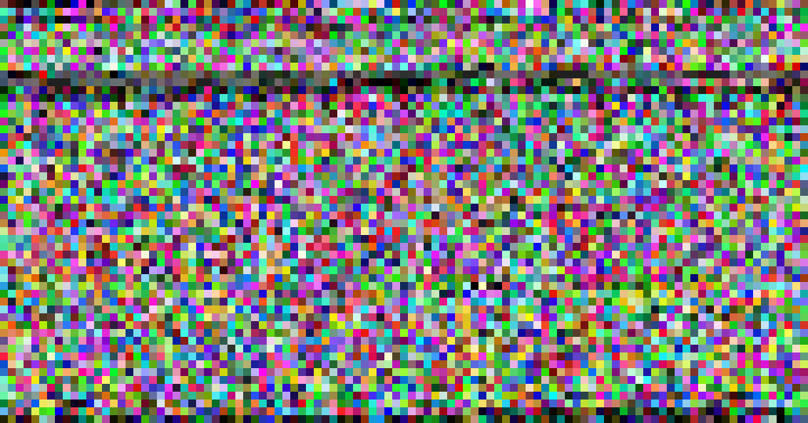

## Soru İsmi: Rengarenk Dosya
Hazırlayan: [penny](https://github.com/pennylaneparker)
## Soru Metni: 

Online CTF'teki rengarenk string isimli sorunun aynısı gibi değil mi? Onu çözebildiysen bunu da rahatlıkla çözebilirsin bence :) Bizim TV ekranı renkli renkli karıncalandı. Saydım 103x54 kutucuk var. ilk kutucuktaki rengin RGB değeri de (137,80,78). Belki flag çıkar bir yerlerden.



## Çözüm: 

1. Her kutucuktaki RGB değerini decimal olarak okuyoruz. Tüm RGB değerlerini hexadecimal e çeviriyoruz ve binary dosya elde ediyoruz.

2. Aşağıdaki script yazılarak flag elde edilir.

```python
import binascii
import sys
from PIL import Image, ImageFont, ImageDraw, ImageEnhance

#Open image file
im = Image.open("rengarenk_dosya.png")
pix = im.load()

hexcontent=""

#Imaj dosyasindaki 10x10 kutucuklarin her birindeki ilk pixeliin rgb degerini okuyor.
for j in range(0,54):
	for i in range(0,103):
		color=pix[i*10,j*10] #Get the RGBA Value of the a pixel of an image
		hexcontent=hexcontent+''.join(hex(c)[2:].zfill(2) for c in color) #RGB degerlerini decimalden hex value ya degistiriyor ve hex value basindaki 0x degerini atiyor.
		print color

#Hex degerinden binary dosya olustuyor.
fout=open('flag', 'wb')
fout.write(binascii.unhexlify(hexcontent))
fout.close()
```

**Flag = STMCTF{0_Z4mAn_D4n5!_R3nK!!!}**
