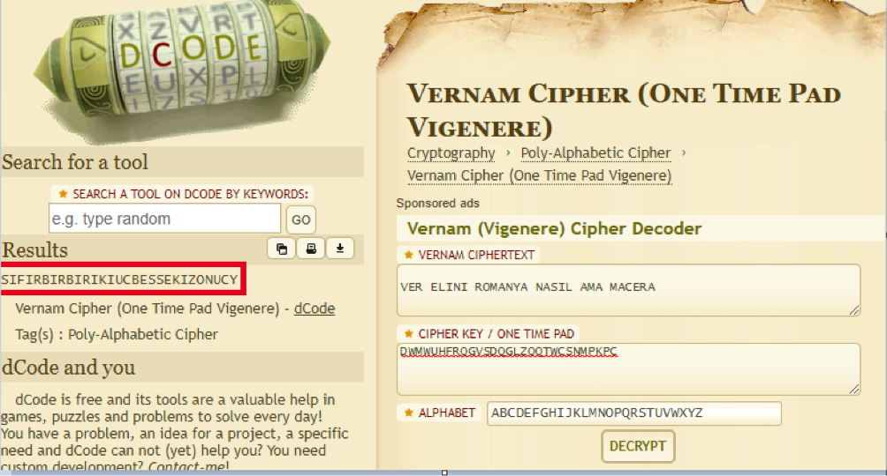
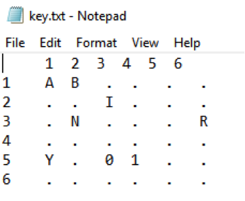
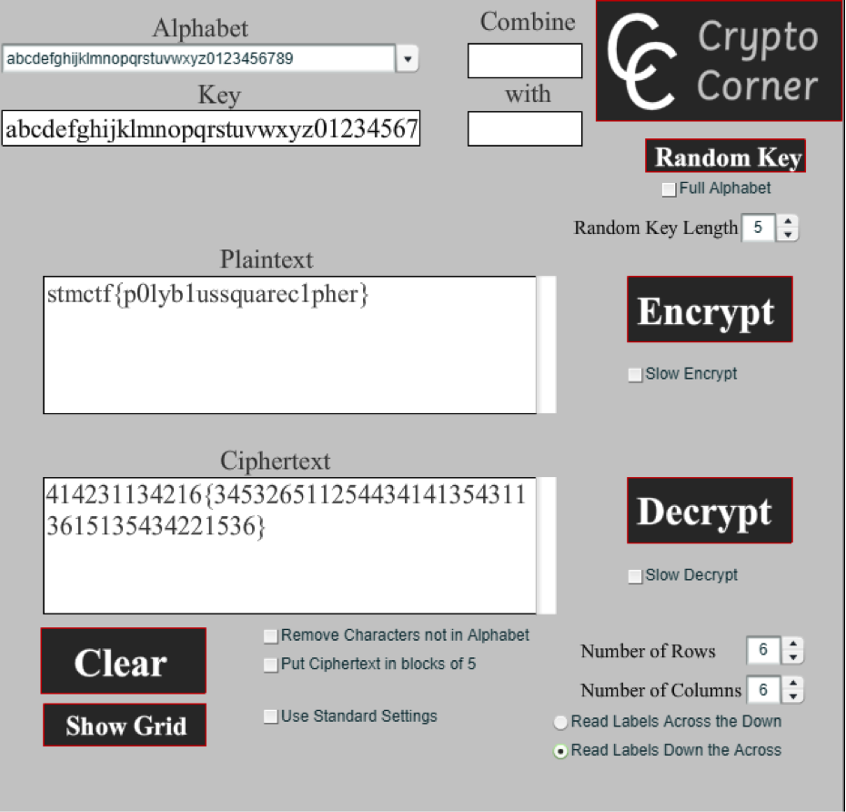

## Soru İsmi: PolyMoly

## Soru Metni: 

Asla kırılamazmış güya. Yahu bunun neresi şifreli ki?

VER ELINI ROMANYA NASIL AMA MACERA?

Oldu olacak anahtarını da verelim de çözün?

DWMWUHFRQGVSDQGLZOQTWCSNMPKPC

Soruda verilen dosya: [polymoly.rar](polymoly.rar)

## Çözüm: 

Vernam Cipher, 1917’de Gilbert Vernam (AT&T) tarafından tasarlanan ve gerekli koşullar sağlandığından teoride kırılması imkânsız olan bir şifreleme algoritmasıdır. Algoritma bir “dizi şifreleme” algoritmasıdır ve mesajla aynı boyda olan rasgele üretilmiş ve tek kullanımlık bir anahtarın mesajın her harfi ile mod(25) ‘de toplanması ile üretilir (İngiliz alfabesinde). 

Vernam algoritmasının özelliği kaba kuvvet saldırılarına karşı dayanıklılığıdır, zira anahtarlar denendikçe anlamlı sayısız açık mesaj elde edilecektir. Biz de bu özelliği vurgulamak için şifreli metni anlamlı bir metin seçtik. **“VER ELINI ROMANYA NASIL AMA MACERA”** şifreli metninin her kelimesindeki ilk harflere bakıldığında VERNAM oluşur ve soru için önemli bir ipucudur. Çözüm aşağıdaki şekildedir.

1. İlgili metin herhangi bir online Vernam Cipher Decoder’da çözdürülürse “SIFIRBIRBIRIKIUCBESSEKIZONUCY” metni elde edilir.

 
2. İlgili sayı dizisini rakamlara döktüğümüzde (0 1 1 2 3 5 8 13 ..) elde edilir. Bu dizi her rakamın kendinden önce gelen iki rakamın toplamına eşit olduğu oldukça bilinen bir dizidir ve Fibonacci dizisi olarak adlandırılır. Kısa bir arama ile de bu bilgiye ulaşılabilir.

3. Soruda verilen rar dosyasının şifresi olarak “fibonacci” denendiğinde açılacaktır.

4. Rar içerisinde 6x6 Polybius karesi ile şifrelenmiş metni içeren cipher.txt dosyası (414231134216{3453265112544341413543113615135434221536}) ve anahtar tablosunun parçalı bir kısmının yer aldığı key.txt dosyası mevcuttur. 

5. 6x6 matriste her harf denk geldiği satır ve sütün ile kodlanır. Örneğin A=11, N=32 vb). Matristeki boşluklara sırasıyla alfabenin harfleri yerleştirilerek ya da online olarak  (http://crypto.interactive-maths.com/polybius-square.html) gibi siteler üzerinden şifreli metin kolayca çözülebilir.

**Flag: stmctf{p0lyb1ussquarec1pher}**
