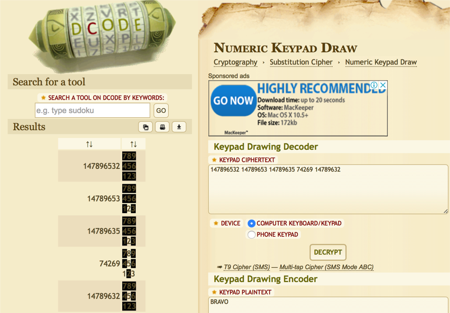

## Soru İsmi: Rakamlar

## Soru Metni: 

147896532 14789653 14789635 74269 14789632

## Çözüm: 

1. Sadece rakamların olması birçok algoritmanın olmayacağı anlamına gelir. Hangi yönteme göre encrypt edildiği ise sayı dizisindeki sıralı 789 lardan veya verilen ipuçlarından anlaşılabilir.

2. İnternette araştırdığımızda Numeric Keypad Cipher olduğunu görüyoruz.

3. Sayı dizileri fazla olmadığı için gözle de encrypted metni düz metin haline getirebiliriz veya online olarak çözüme ulaşabiliriz.

**Flag  = STMCTF{BRAVO}**
