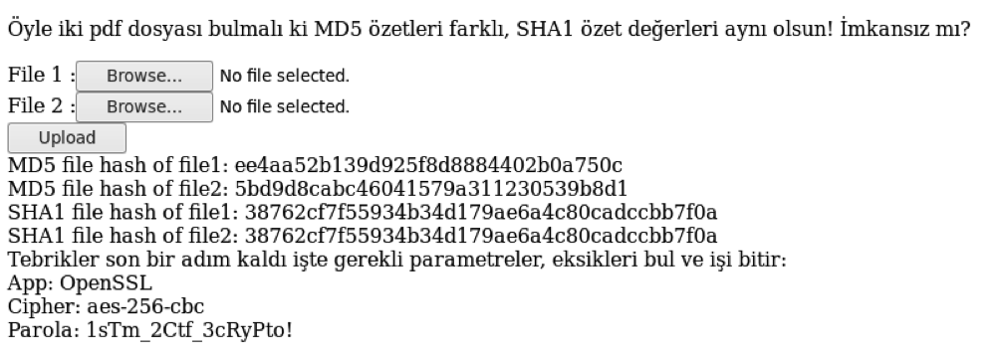
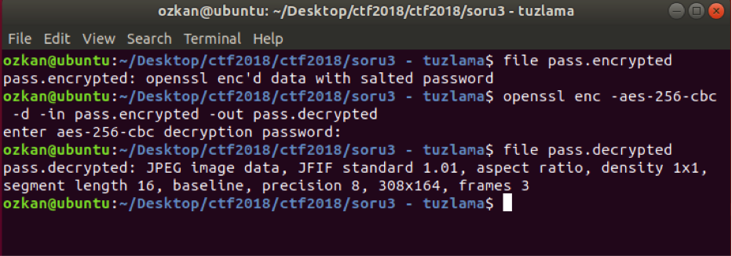
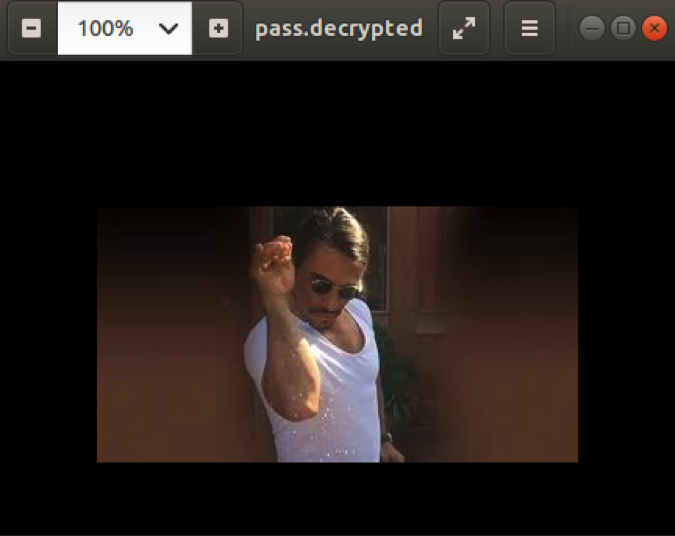
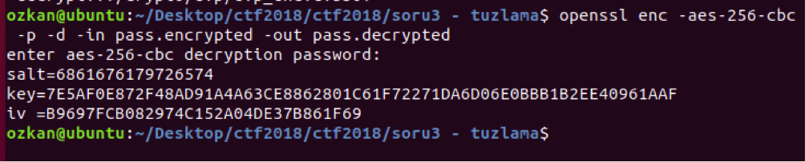

## Soru İsmi: Tuzlama

## Soru Metni: 

çok az web biraz crypto.

web.team<MASA_NO>.stmctf:8888

Soruda verilen dosya: [tuzlama.zip](tuzlama.zip)

## Çözüm: 

1. Normal şartlar altında iki farklı dosyanın algoritmadan bağımsız tüm özet değerlerinin farklı olması gerekir. Ancak Google araştırmacıları 2017 yılında SHA1 algoritmasında buldukları zayıflıkla 2 farklı dosyayı aynı özet değerine götüren bir çakışma saldırısı yapabilmişlerdir. İlgili online aramalar yarışmacıları http://shattered.io/ sitesine götürmektedir ve site üzerinde hali hazırda yayınlanan iki pdf dosyası upload edilebilir. İlgili uploadlar sonrası gelen ekran görüntüsü aşağıdaki gibidir. 

 
2. Soru ile beraber verilen flag.rar ve pass.encrypted dosyalarının ikisi de şifrelidir. Flag.rar bir rar parolasına ihtiyaç duyarken pass.encrypted dosyası OpenSSL ile şifrelidir ve gerekli parametreler yukarıdaki ekran görüntüsünde verilmiştir. Bu parametreler kullanılarak ilgili dosya çözülür ve JPEG dosyası olduğu anlaşılır.

3. Dosya açıldığında Nusret’in meşhur fotosu çıkar ancak ötesi yoktur :)

4. Soru başlığı ve bu resim yarışmacıları “salt” üzerinde yoğunlaştırır. “pass.encrypted” dosyası üretilirken parolanın entropisi ihtiyaç duyulan AES256 anahtarını üretmeye yetmeyeceğinden 32 bitlik SALT değeri ile rassallaştırma yapılır. Bu değer paroladan AES anahtarı elde etmeye yarayacağından kaybedilmemelidir ve dosyanın en başına yazılır. Bundan sonra yapılması gereken bu değerin bulunup flag.rar dosyasının parolası olarak denenmesidir. Dosya hex editörle incelenebilir ya da `openssl –p` parametresi ile salt değeri ekrana yazdırılabilir. 

**Flag  = STMCTF{hashden_g1rd1k_tuzdan_c1kt1k}**
