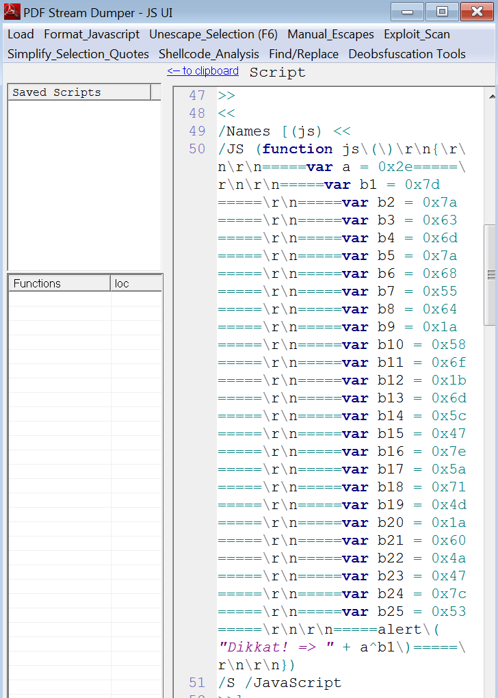

## Soru İsmi: Analiz

## Soru Metni: 

Dosyayı analiz et bakalım neler bulacaksın?

Soruda verilen dosya: [analiz.zip](analiz.zip)

## Çözüm: 

1. Soruda verilen _oldbrowser_ ipucundan hareketle javascript kodunun PDF içine gömüldüğünü anlayabiliriz. Pdf içindeki javascript kodunu görüntüleyebilen bir pdf editing aracı ile javascript kodunu görebiliriz. Ayrıca PDFStreamDumper aracı ile pdf içindeki streamleri görebiliriz. Bu streamler arasında javascript kodumuz ortaya çıkacaktır.

2. Javascript kodunda hex değerlerin hex olarak 0x2e ile xor işlemi yapıldığı görülüyor. XOR işlemi yaptığımızda flag elde ediliyor.

**Flag  = STMCTF{J4vA5CriPt_c4NdiR}**
