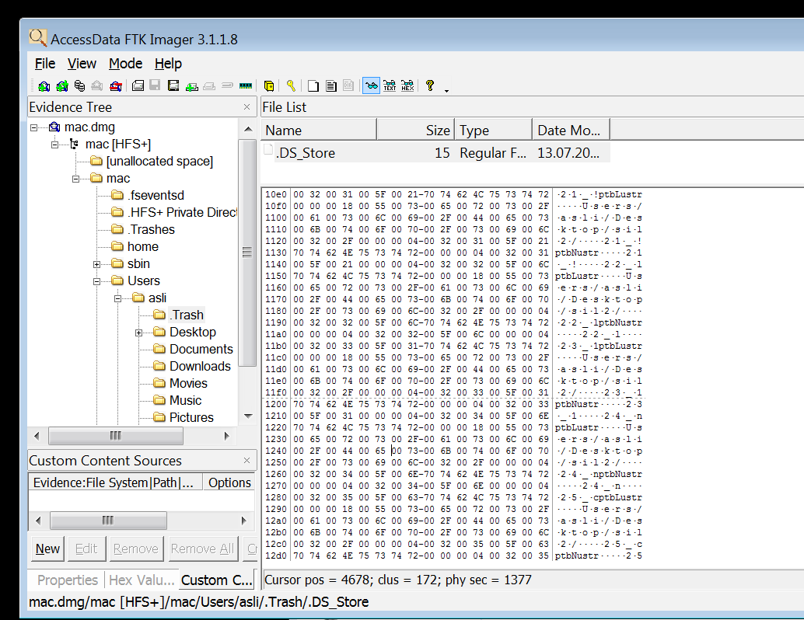
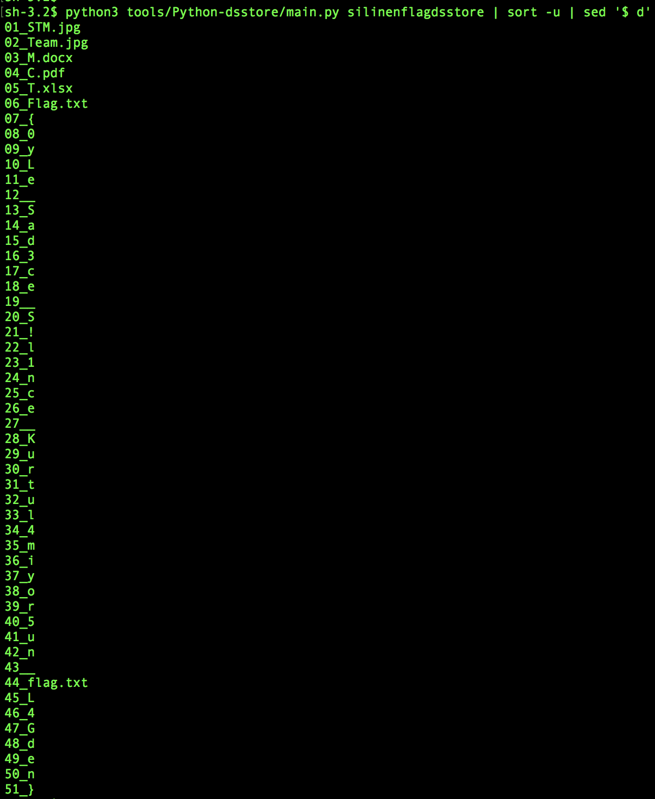

## Soru İsmi: Silinen Flag
Hazırlayan: [penny](https://github.com/pennylaneparker)
## Soru Metni: 

aslı'nın forensic sorusunu hazırladığı pcnin imajını aldık ona çaktırmadan. Ama flag i silmiş ne yazık ki :( Belki sen bir şekilde alabilirsin.

Soruda verilen dosya: [mac.dmg](mac.dmg)

## Çözüm: 

1. mac.dmg dosyası FTK imager ile mount edebilir veya 7ziple açabilir. Soruda silinen flagden bahsedildiği için Trash e bakılıyor. Burada sadece .DS_Store dosyası bulunuyor. 

.DS_Store dosyası için [wikipedia](https://en.wikipedia.org/wiki/.DS_Store) bilgisi:

> In the Apple macOS operating system, .DS_Store is a file that stores custom attributes of its containing folder, such as the position of icons or the choice of a background image.[1] The name is an abbreviation of Desktop Services Store,[2] reflecting its purpose. It is created and maintained by the Finder application in every folder, and has functions similar to the file desktop.ini in Microsoft Windows. Starting with a full stop (period) character, it is hidden in Finder and many Unix utilities. Its internal structure is proprietary.

2. /mac/Users/asli/.Trash/.DS_Store dosyası export edilerek https://github.com/gehaxelt/Python-dsstore aracı ile parse edilirse dosya isimlerinin ilk harflerinden flag elde ediliyor.

`python3 tools/Python-dsstore/main.py .DS_Store | sort -u | sed '$ d'`

**Flag  = STMCTF{0yLe_Sad3ce_S!l1nce_Kurtul4miyor5un_fL4Gden}**
