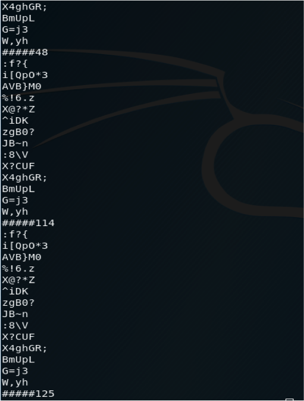
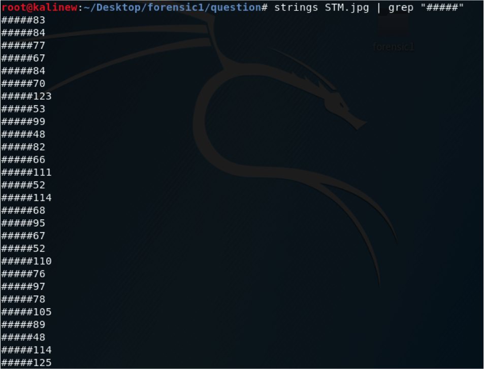
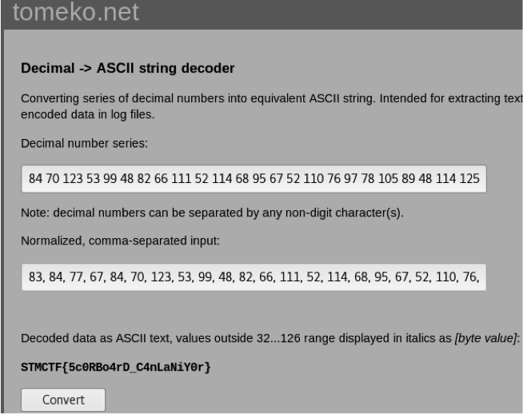

## Soru İsmi: Top Secret

## Soru Metni: 

## Çözüm: 

1. Mobil uygulamanın içerisindeki native dosyanın dissassemblerla açılmasıyla bayrak görülebilir.

1. Dosyanın stringleri incelendiğinde dikkatimizi çeken bazı değerler olduğunu görebiliriz.

2. Stringler içinde bulunan tüm ##### değerleri başlayan ifadeleri bulmalıyız.

3. Karşımızdaki tüm decimal değerlerin ascii karşılıklarını bularak flag değerini ortaya çıkarabiliriz.

**Flag  = STMCTF{5c0RBo4rD_C4nLaNiY0r}**
