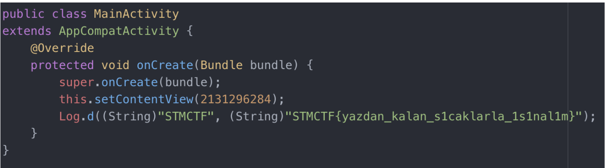

## Soru İsmi: Mobil1
Hazırlayan: [mertcan](https://twitter.com/mertcancoskuner)
## Soru Metni: 

ısınma turu

Soruda verilen dosya: [basit_mobil.apk](basit_mobil.apk)

## Çözüm: 

1. Uygulamayı dex2jar ile decompile ettikten sonra kaynak koda bakıldığında flag görünmektedir.

**Flag  = STMCTF{yazdan_kalan_s1caklarla_1s1nal1m}**
