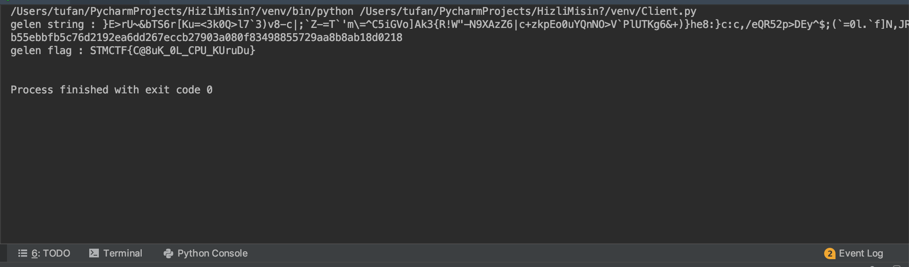

## Soru İsmi: Hızlı mısın?

## Soru Metni: 

Gelen metnin SHA256'sını göndermen için 2 saniyen var  nc web.team<MASA_NO>.stmctf 9999

## Çözüm: 

1. Verilen IP üzerinden yapılan istek üzerine gelen rastgele string’in 5 saniye içerisinde hashini istedik. [Client.py](Client.py) python kodu içerisinde veri çekme işlemi ve hash alma işlemi görülebilir. [Client.py](Client.py) uygulamasının çıktısı aşağıdaki gibidir.

FLAG: STMCTF{C@8uK_0L_CPU_KUruDu}

