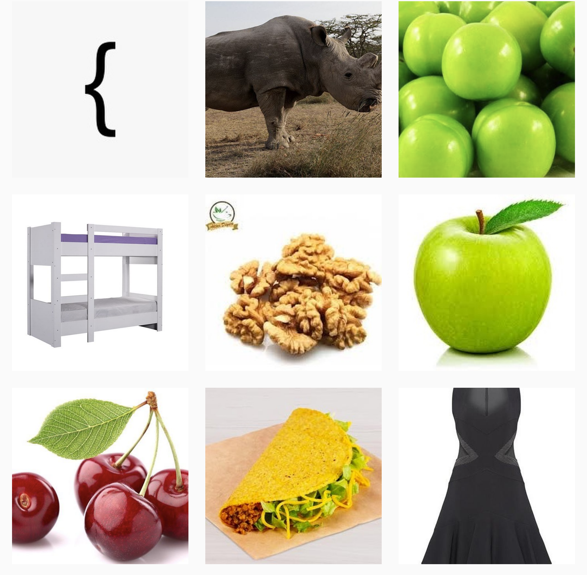

## Soru İsmi: Instaflag

## Soru Metni: 

Instagram sayfamızdaki flagi bulabilecek misiniz? Bütün harfler büyük.

## Çözüm: 

1. STM CTF’in instagram sayfasında bir tane flag olduğunu soru da verdik. Instagram üzerinden STMCTF diye aratınca çıkan sayfada(https://www.instagram.com/stmctf/?hl=tr)
Görülen ilk görselin, flag formatında yer alan süslü parantez olduğunu görünce flagin fotoğraflardan çıkacağı anlaşılıyor. Sonrasında ilk fotoğrafların açıklama kısmıda yer alan ipucu ile de fotoğrafta yer alan cisimlerin ilk harflerinden flag çıktığı anlaşılmaktadır.

2. Bütün fotoğraflar incelendiğinde karşımıza flag çıkmaktadır.

FLAG: STMCTF{GERCEKTEN_ZOR_BIR_FLAG_MI_?}

