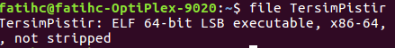
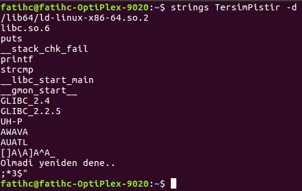
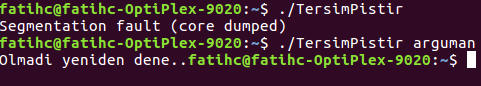
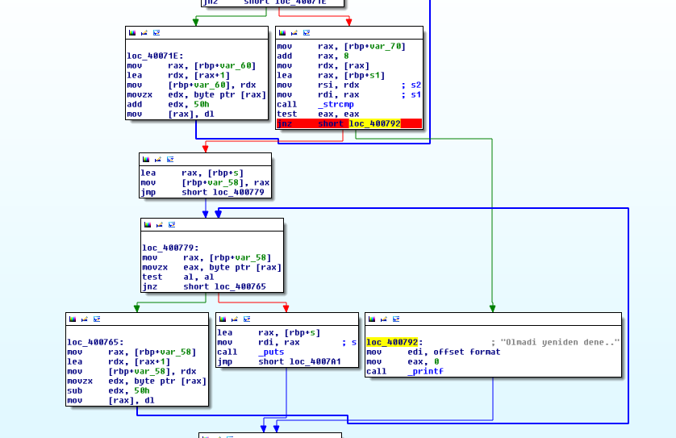
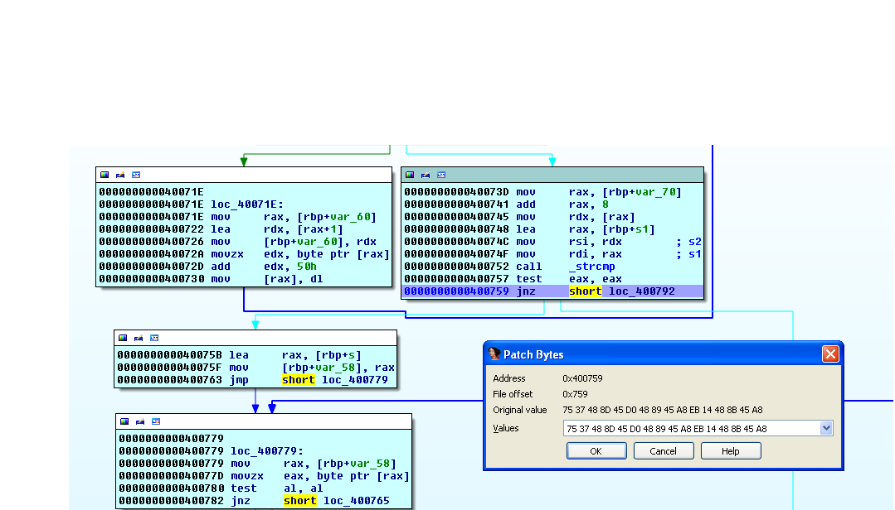
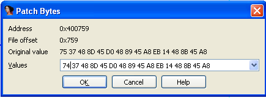
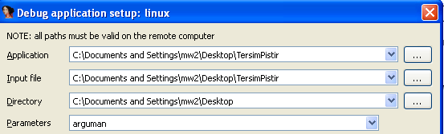
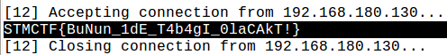

## Soru İsmi: tersimpistir

## Soru Metni: 

tersimpistir :)

Soruda verilen dosya: [TersimPistir](TersimPistir)

## Çözüm: 

1. Öncelikle elimizdeki dosyanın tipine bakıyoruz ve 64-bit ELF executable binary olduğunu görüyoruz.

2. Strings komutu ile içinde bulunan stringleri inceliyoruz.

3. “Olmadı yeniden dene..” stringini fark ediyoruz. Dosyayı argümansız olarak çalıştırdığımızda Segmentation fault hatası ile karşılaşıyoruz. Argüman vererek çalıştırdığımızda ise aşağıdaki çıktıyı veriyor. 

4. IDA kullanarak dosyayı inceliyoruz. Graph View’da yukarıdan aşağı hızlı bir tarama yaptığımızda “Olmadı yeniden dene..” stringinin print edildiği yeri fark ediyoruz. (Strings View’dan ilgili stringin cross referanslarına bakarak da buraya gelebiliriz.) 

5. Buraya  jnz short loc_408792 instruction’ı ile atlandığını fark ediyoruz. Buraya bir breakpoint koyarak debugger’ı çalıştırdığımızda program “Olmadi yeniden dene..” çıktısını basarak sonlanıyor.

6. jnz’yi jz olarak patchliyoruz ve tekrar çalıştırıyoruz. (En baştaki 75’i 74 yapıyoruz.)

Not: Debug ederken debugger options’tan Parameters kısmına bir argüman girilmesi gerekmektedir, argümansız çalıştırıldığı takdirde segmentation fault hatası alınır.

7. Tekrar çalıştırdğımızda debugger’ın çıktısı aşağıdaki görüldüğü üzere flag’i veriyor.

STMCTF{BuNun_1dE_T4b4gI_0laCAkT!}

