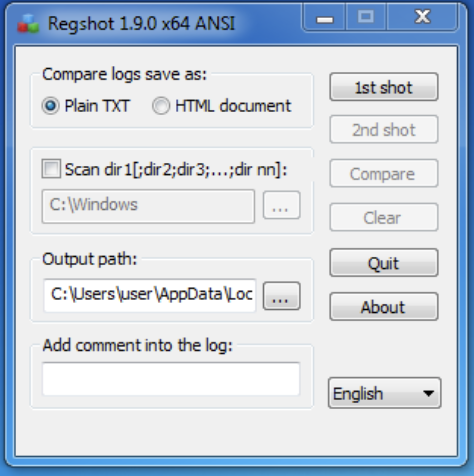
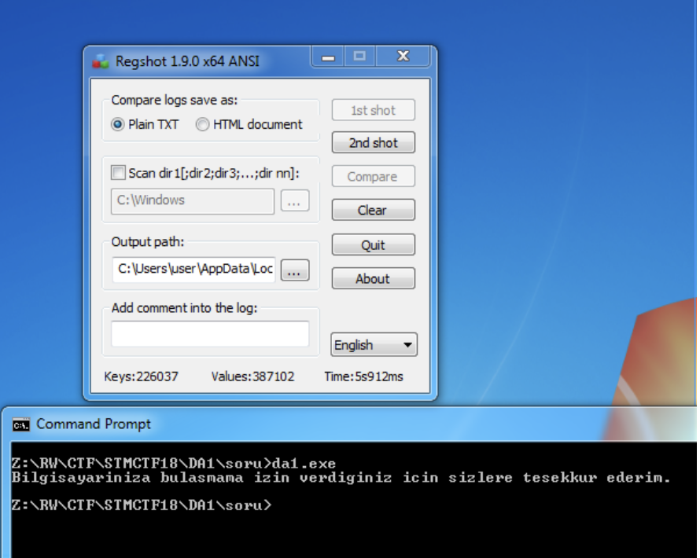
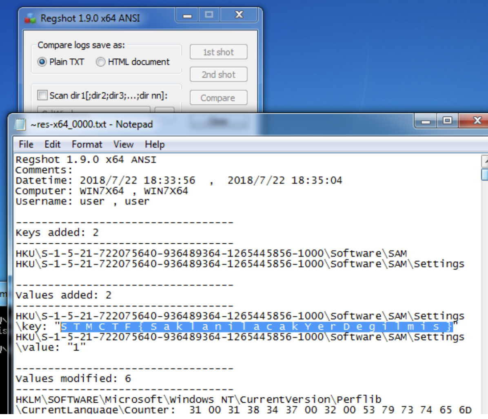

## Soru İsmi: DA1

## Soru Metni: 

Zararlı yazılım bilgisayarına imzasını bırakıyor. FLAG de bu imza.

Soruda verilen dosya: [da1.zip](da1.zip)

## Çözüm: 

1. da1.exe programı çalıştırılmadan önce Regshot programı ile registry snapshot’ı alınır.

2. da1.exe programını çalıştırıyoruz. Daha sonra Regshot programı ile registry snapshot’ı ikinci kez alınır.

3. Regshot raporunda değişen registry kayıtlarında **FLAG STMCTF{SaklanilacakYerDegilmis}** olarak gözükür. Kolaymış değil mi?

