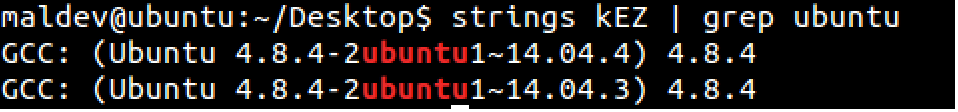
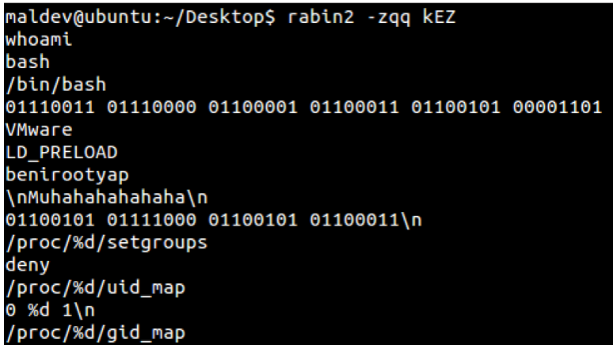
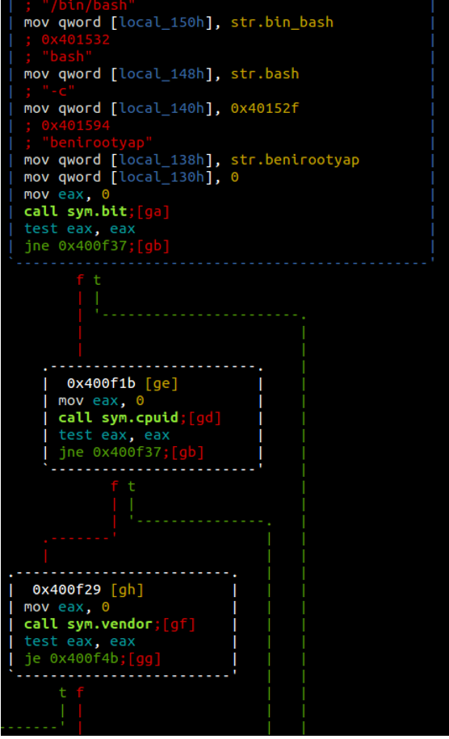
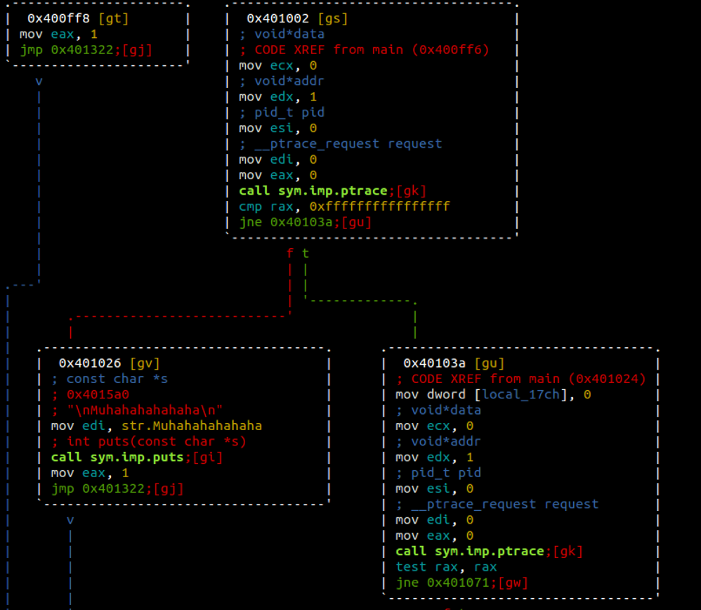
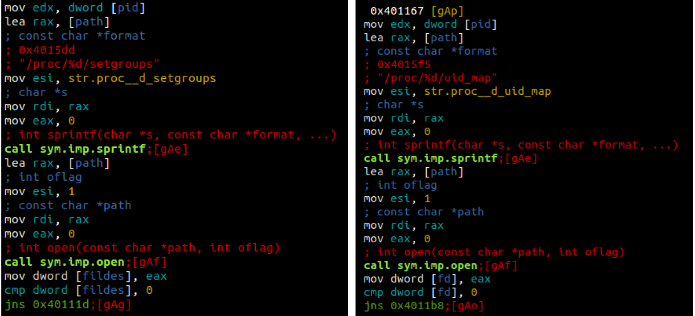
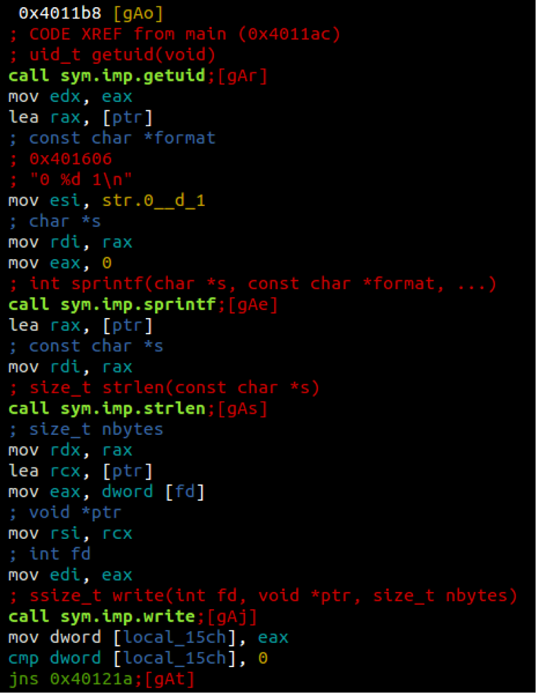

## Soru İsmi: LNX
Hazırlayan: [mertcan](https://twitter.com/mertcancoskuner)
## Soru Metni: 

Zararlı davranış gösterebilirdim ama bu seferlik affediyorum. Davranışlarımı bulursan bayrak senindir.  Örnek bayrak; Davranışlar Anti-Sandbox, Anti-Debug, CVE-2008-4250 istismarı ise bayrak STMCTF{ANTISANDBOXANTIDEBUGCVE-2008-4250} şeklinde yazılacak.

Soruda verilen dosya: [kEZ.zip](kEZ.zip)

## Çözüm: 

1. Zararlı bir 64-bit elf dosyasıdır. Zararlının temel incelemesinde aşağıdakiler elde edilmiştir;

2. Zararlının Ubuntu 14.04’de derlendiği ve bazı anti-* teknikleriyle donatıldığını görülmektedir. Binary değerler ASCII’ye çevrildiğinde “space” ve “exec” stringleri karşımıza çıkmaktadır.

3. Statik incelemede zararlının “cpuid” ve “vendor” gibi değerleri kontrol ettiği görülmektedir. İçerisinden çıkan “VMWare” stringi ile beraber bu kontroller “Anti-VM” tekniği olduğunu göstermektedir.

4. Statik incelemeye devam edildiğinde zararlının pek çok kez ptrace ile debugger kontrolü yaptığı görülmektedir. Bu kontroller zararlının “Anti-Debug” özelliğine sahip olduğunu göstermektedir.

5. Kontroller sonrasında zararlı, istismar kodu çalıştırarak yetki yükseltme yapmaktadır. İlgili yetki yükseltme istismar kodunun “space” ve “exec” stringleri yardımıyla araştırılması sonucunda https://www.exploit-db.com/exploits/41762/ istismarının kullanıldığı tespit edilebilmektedir.

6. Anti-* teknikler ve istismar kodu uç uca eklendiğinde aşağıdaki flag elde edilmektedir.

**Flag  = STMCTF{ANTIVMANTIDEBUGGINGCVE-2016-1575}**
