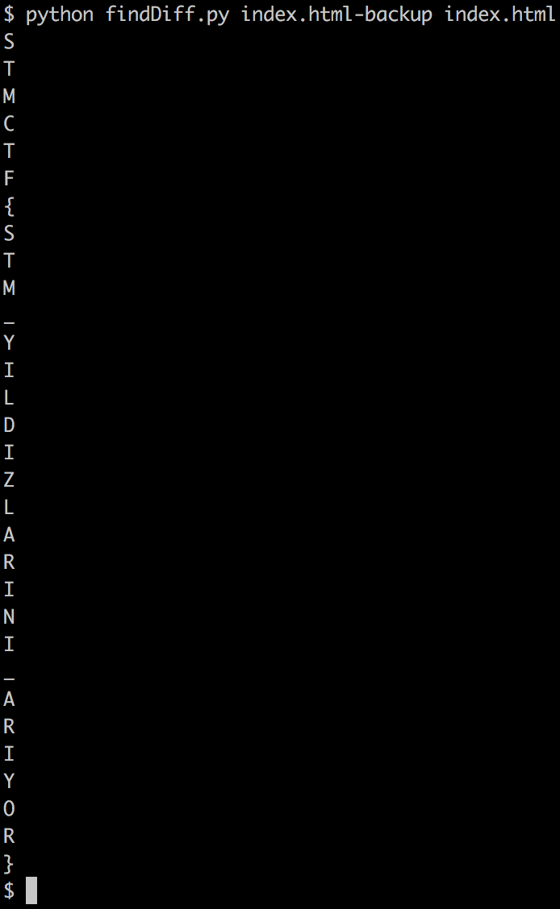

## Soru İsmi: DIFFIE_HELLMAN

## Soru Metni: Bu dosyayı diffie-hellman okusalardı bayrağı bulabilir miydi?

Soruda verilen dosya: [index.html](index.html)

## Çözüm: 

STM'nin anasayfasi (www.stm.com.tr) kaynak kodu uzerinde bazi harfler degistirilmistir. Verilen dosya ile internette CTF gunu yer alan STM  websitesi arasindaki fark incelenmelidir.

2 dosya arasindaki farklara asagidaki arac ile bakabiliriz:

$ diff -u index.html index-modified.html

Ancak cok fazla fark oldugu icin elle yapmak zor olacaktir. Bu yuzden aradaki karakter farkliliklarini cikartan ufak bir python scripti ile flag elde edilebilir.
#findDiff.py ile cozulebilir.
```
# findDiff.py dosya icerigi:
import sys
lines1 = [line.rstrip('\n') for line in open(sys.argv[1])]
lines2 = [line.rstrip('\n') for line in open(sys.argv[2])]

for i in range(0,len(lines1)):
    if lines1[i] != lines2[i]:
        for char1, char2 in zip( lines1[i], lines2[i] ):
            if char1 != char2:
                print char2
                break
```                

Internetten indirilen dosya: [index.html-backup](index.html-backup)

Calistirilan komut:
``` python findDiff.py index.html-backup index.html ``` 



**Flag = STMCTF{STM_YILDIZLARINI_ARIYOR}**
