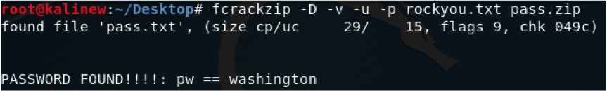
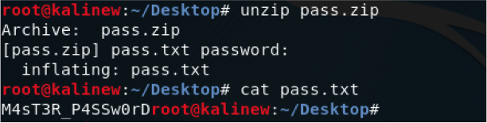
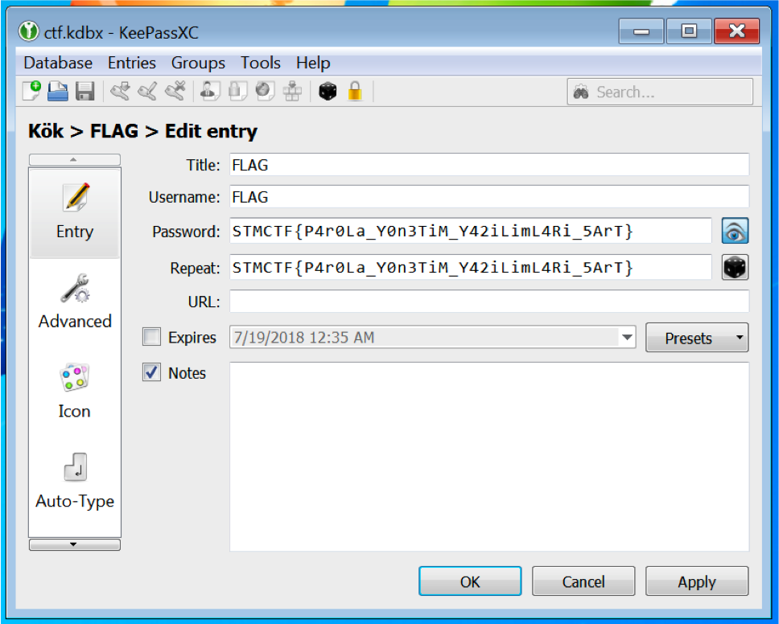

## Soru İsmi: Her Yer Parola

## Soru Metni: 

Ekibimiz pentest esnasında tuhaf bir dosyaya erişti bu dosya içerisinden bilgi almak gerekecek ama nasıl?

Soruda verilen dosya: [HerYerParola.zip](HerYerParola.zip)

## Çözüm: 

1. Soruda verilen kdbx uzantılı dosyanın hangi yazılıma ait olduğu araştırılmalıdır. Araştırma sonucunda görülecektir ki KeePassXC parola yönetim yazılımının veritabanı dosyasıdır. Fakat bu veritabanı encrypted olarak depolandığı için master passworda ihtiyaç vardır veritabanını açabilmek için.Bu password ise pass.zip içinde bulunuyor.

2. Fcrackzip aracına rockyou.txt yi verdiğimizde pass.zip parola bulunur ve zip dosyası açılarak master passworda ulaşılır.

3. KeePassXC yazılımı açılır ve master password ile ctf.kdbx veritabanı görüntülenerek flag e ulaşılır.

**Flag  = STMCTF{P4r0La_Y0n3TiM_Y42iLimL4Ri_5ArT}**
