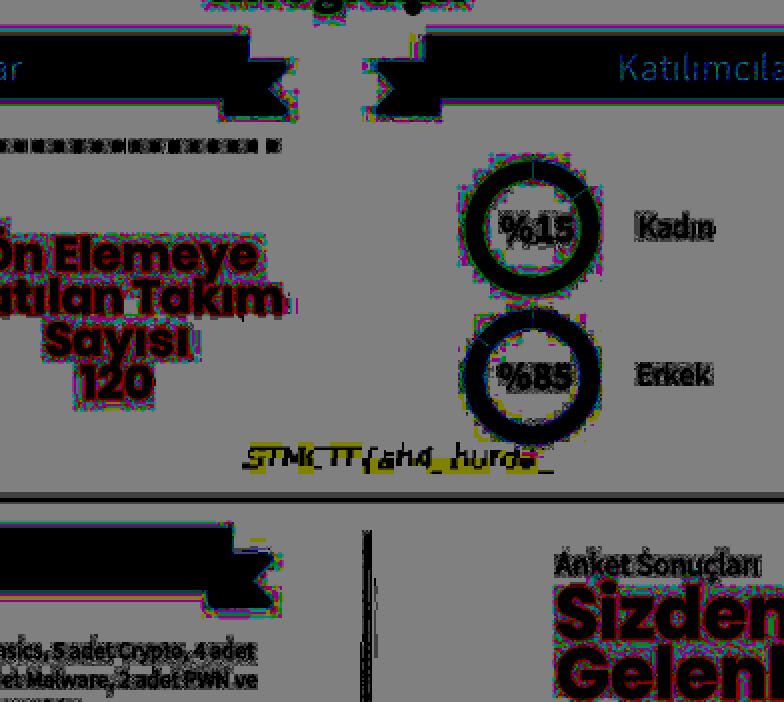

## Soru İsmi: Sen Hayırdır?

## Soru Metni: 

STMCTF ekibi yazdığı dökümanlara bir şeyler saklamayı sever, bakalım saklanmış bayrağı bulabilecek misin? Ama flage parantez({}) eklemeyi unutmuşuz. Siz ekleyin artık :)

Soruda verilen resim: [resim](https://twitter.com/StmCTF/status/1047142475272531969)

## Çözüm: 

1. twitter.com/stmctf hesabında yer alan infografik resmi indirilip üzerinde oynandığında flag
görülmektedir.

STMCTF{ah4_burda_}

