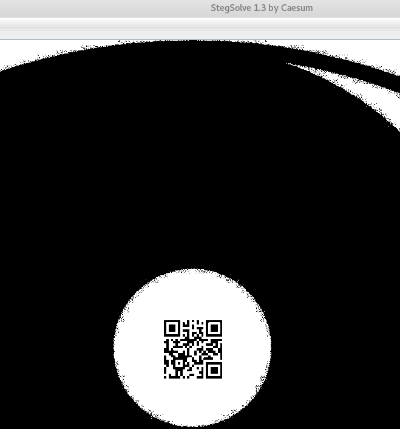
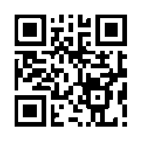
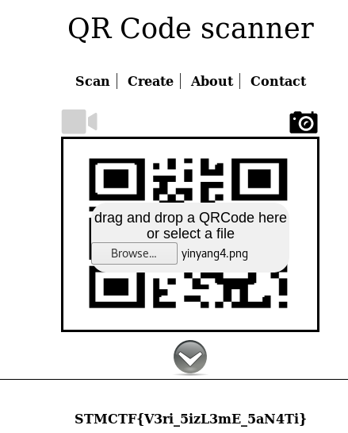

## Soru İsmi: YINYANG
## Soru Metni: 
No text no cry :)

Soruda verilen resim: [resim](yinyang.png)

## Çözüm: 

1. Soruda verilen PNG dosyasına dikkatli baktığımızda soluk bir vaziyette bulunan QR kodu görebiliriz. 

2. Eğer QR kodu göremediysek steganografi araçları veya  PNG dosyası üzerinde edit işlemleri yapabileceğimiz bir araç yardımıyla QR kodu görebiliriz. 

3. QR kod okuyucuların decode edebileceği bir parlaklığa gelen QR kod okutulmaya çalışılır. Burada QR kod mirror flip tekniği ile çevrildiği için her QR kod okuyucu decode işlemini yapamaz. 
Gimp aracıyla mirror flip tekniğini uygulayarak doğru QR biçimine çevrilir.

4. QR kod okutulduğunda flag değerimiz ortaya çıkar.

Flag: STMCTF{V3ri_5izL3mE_5aN4Ti}
