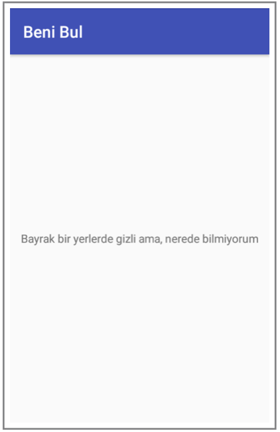
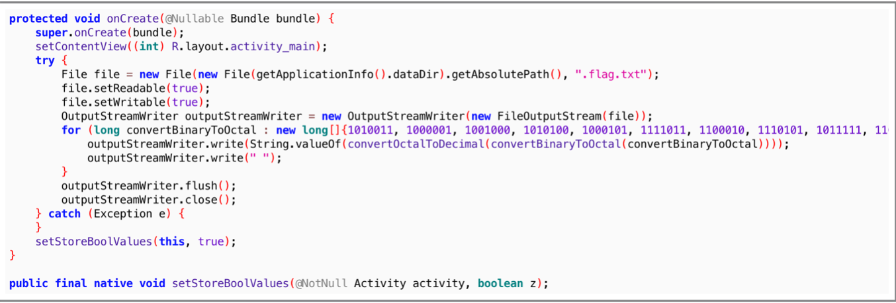
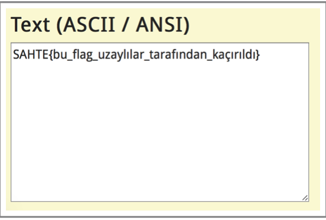
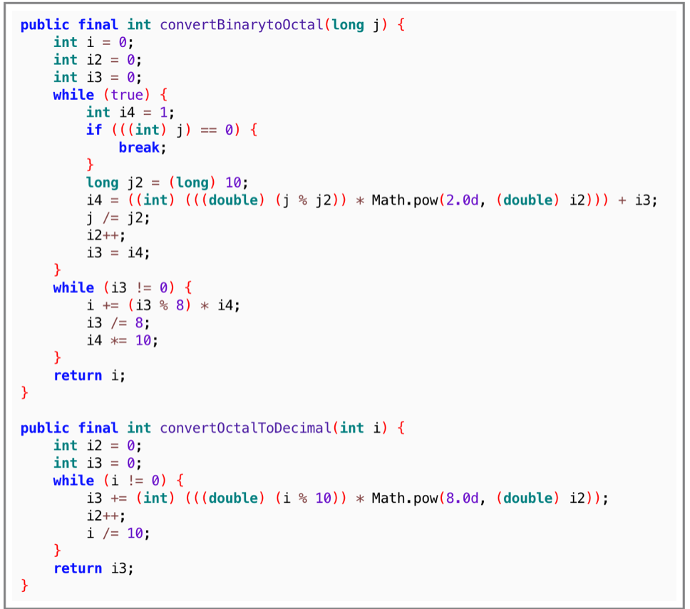
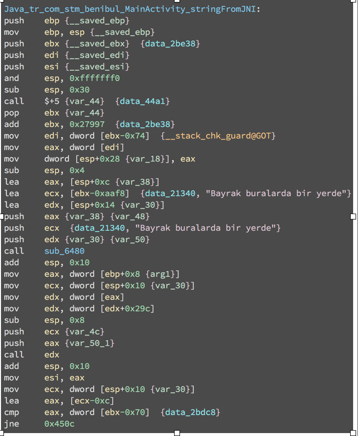
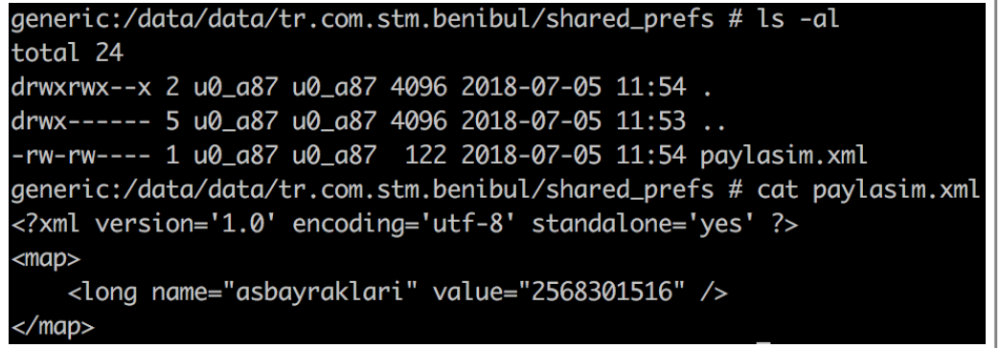
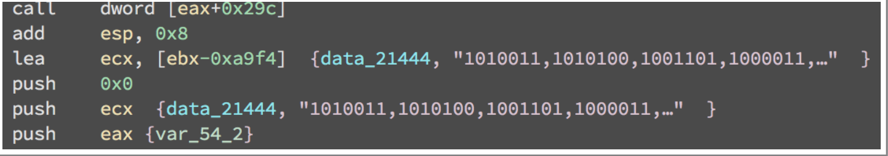
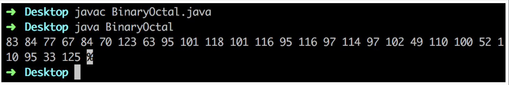
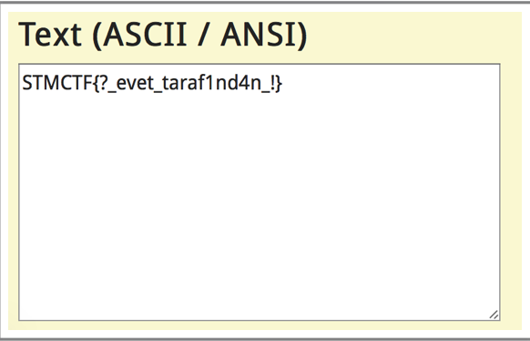

## Soru İsmi: Beni Bul
Hazırlayan: [mertcan](https://twitter.com/mertcancoskuner)
## Soru Metni: 

FLAG uygulamanın içinde saklı, bakalım bulabilecek misin?

Soruda verilen dosya: [benibul.zip](benibul.zip)

## Çözüm: 

1. Uygulama ekranı aşağıdaki gibidir. Amaç uygulama içerisine saklanmış bayrağı bulmaktır.



2. Uygulama dex2jar-2.1 ve apktool ile açıldıktan sonra incelenebilir duruma gelmektedir.

`apktool d benibul.apk`

`d2j-dex2jar benibul.apk`

3. Dex2jar çıktısı Jadx ile açıldığında bir adet class olduğu görülmektedir; MainActivity. MainActivity içerisinde binary değerlerin iki adet fonksiyondan geçirildiği ve uygulama klasörü altında .flag.txt dosyasına yazıldığı görülmektedir. 



4. .flag.txt dosyası açıldığında decimal değerler olduğu görülmektedir. Bu değerler ASCII formatına çevrildiğinde bu bayrağın sahte olduğu görülmektedir.



5. Binary değerleri çeviren fonksiyonlar aşağıdaki gibidir.



6. MainActivity içerisinde yer alan başka bir fonksiyon ise native setStoreBoolValues fonksiyonudur. Apktool içerisinde yer alan /lib dizininde bulunan libnative-lib.so açılıp incelendiğinde stringFromJNI fonksiyonunda bayrağın burada olduğunu söyleyen bir string görülmektedir.



7. İnceleme yapıldığında native kütüphane içerisinde setStoreValues ve setStoreBoolValues adında iki adet fonksiyon daha olduğu görülmektedir. Bunlardan setStoreBoolValues fonksiyonunun shared_preferences altına bir boolean bir de long değer yazdığı görülmektedir.


8. Uygulama altındaki shared_preferences klasörüne bakıldığında aşağıdaki değerler görülmektedir.



9. İlgili değerin yazıldığı binary değeri setStoreBoolValues fonksiyonunda aşağıdaki gibi yer almaktadır. Asbayraklari değerinin native kütüphanede yer alan binary değerinin long tipinde gösterimi olduğu görülmektedir.



10. Bulunan binary değerinin yanlış bayrağın hesaplandığı fonksiyonlara verilerek çevrilmesi için gerekli java kodu aşağıdaki gibidir.

```java
class BinaryOctal {

    public static void main(String[] args) {
        long[] binary = {1010011,1010100,1001101,1000011,1010100,1000110,1111011,111111,1011111,1100101,1110110,1100101,1110100,1011111,1110100,1100001,1110010,1100001,1100110,110001,1101110,1100100,110100,1101110,1011111,100001,1111101};
        for (int i = 0; i < binary.length; i++) {
            int octal = convertOctalToDecimal(convertBinaryToOctal(binary[i]));
            System.out.printf("%d ", octal);
        }
    }

    public static int convertBinaryToOctal(long j) {
        int i = 0, i3 = 0, i2 = 0;
        while(j != 0) {
            i3 += (j % 10) * Math.pow(2, i2);
            ++i2;
            j /= 10;
        }
        i2 = 1;
        while (i3 != 0) {
            i += (i3 % 8) * i2;
            i3 /= 8;
            i2 *= 10;
        }
        return i;
    }

    public static int convertOctalToDecimal(int i) {
        int i3 = 0, i2 = 0;
        while(i != 0) {
            i3 += (i % 10) * Math.pow(8, i2);
            ++i2;
            i/=10;
        }
        return i3;
    }

}
```

11. İlgili java kodu çalıştırıldığında aşağıdaki decimal değerler elde edilmektedir.



12. Decimal değerler ASCII formatına çevrildiğinde gerçek bayrak değeri ortaya çıkmaktadır.



**Flag  = STMCTF{?_evet_taraf1nd4n_!}**
