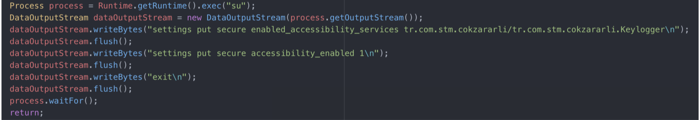
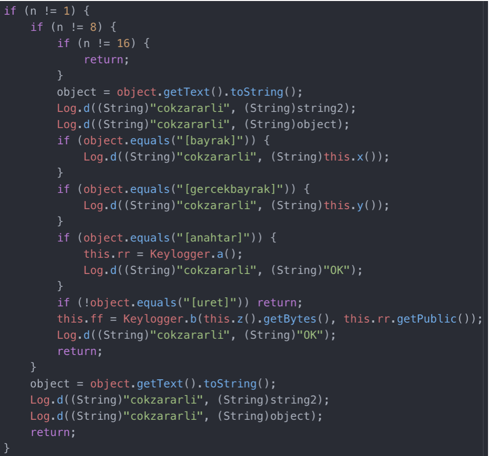

## Soru İsmi: Çok Zararlı
Hazırlayan: [mertcan](https://twitter.com/mertcancoskuner)
## Soru Metni: 

Bu zararlı başka zararlılara benzemez. Niyeti zarar değil bayrak vermek.

Soruda verilen dosya: [cokzararli.zip](cokzararli.zip)

## Çözüm: 

1. Uygulamanın Keylogger classı için accessibility aktivasyonu yaptığı görülmektedir.



2. Keylogger classı kullanıcının girdilerini yakalamaktadır. Uygulama, yer alan [anahtar], [uret] girdilerinin kullanıcı tarafından girildiğini gördükten sonra [flag] stringine tıklandığını algıladığında bayrak vermektedir.

3. İlgili işlemlerin sırasıyla yapılması yerine [uret] tarafından çağırılan z() fonksiyonu Frida ile aşağıdaki şekilde çağırılarak bayrak üretilebilir.




4. İlgili frida kodu

```java
Java.perform(function() {
    Java.choose("tr.com.stm.cokzararli.Keylogger", {
        onMatch: function (func) {
         console.log(func.z())
        },
        onComplete: function (){
        }
    })
```

**Flag  = STMCTF{_gercekten_deliricigim_artik_}**
