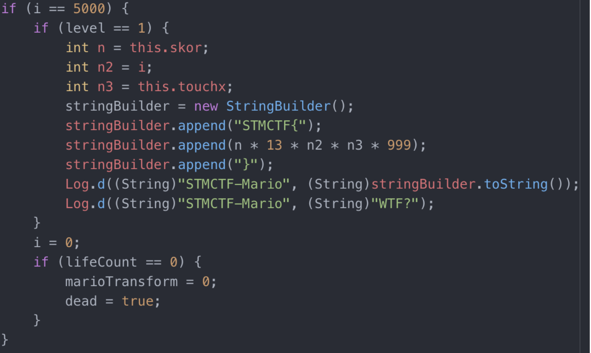

## Soru İsmi: Muslukcu
Hazırlayan: [mertcan](https://twitter.com/mertcancoskuner)
## Soru Metni: 

Muslukçu geziyor, kaplumbağa üzerinden zıplıyor, ejderhayla savaşıyor, prenses kurtarıyor ama bir hesabı yapamıyor! Muslukçuya bayrağı hesaplamasında yardımcı olur musun?

Soruda verilen dosya: [muslukcu.apk](muslukcu.apk)

## Çözüm: 

1. Bayrak hesabı kaynak kodda aşağıdaki şekilde görülmektedir

2. Bu hesabı android uygulaması yaparken değer overflow olmakta ve (-) bir değer üretmektedir. İlgili değerlere göre bayrak hesabı elle yapıldığında gerçek bayrağa ulaşılmaktadır.

**Flag  = STMCTF{3116880000000}**
