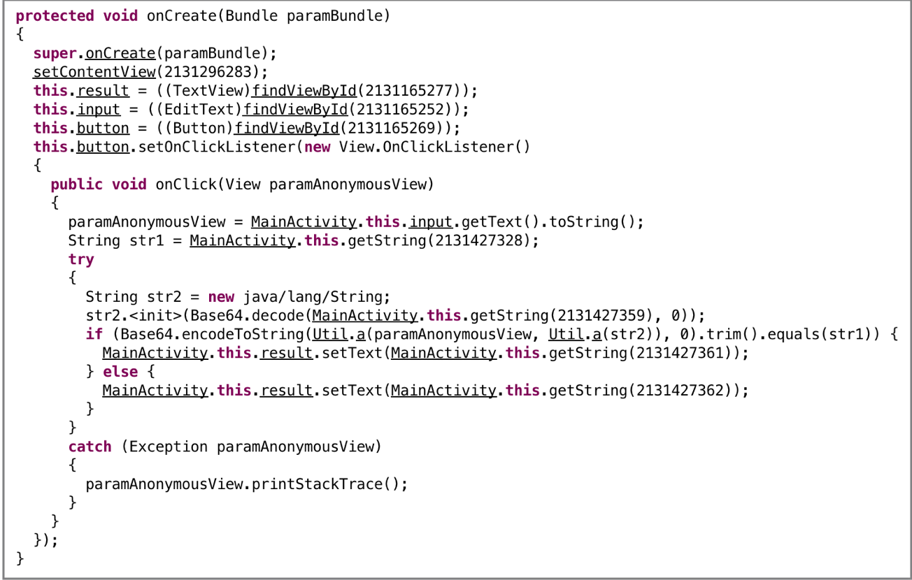
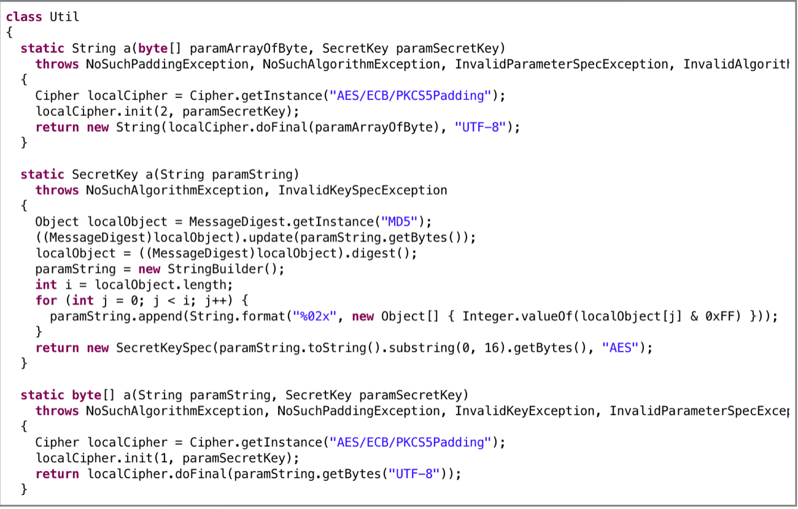

## Soru İsmi: Tersle Beni
Hazırlayan: [mertcan](https://twitter.com/mertcancoskuner)
## Soru Metni: 

Şifreyi çöz bayrağı kap

Soruda verilen dosya: [terslebeni.zip](terslebeni.zip)

## Çözüm: 

1. Uygulama ekranı aşağıdaki gibidir. Amaç uygulamayı tersine mühendislik yöntemleriyle açıp doğru stringi bulmaktır.






2. Uygulama dex2jar-2.1 ve apktool ile açıldıktan sonra incelenebilir duruma gelmektedir.

`apktool d terslebeni.apk`

`d2j-dex2jar terslebeni.apk`

3. Dex2jar çıktısı JD-GUI ile açıldığında iki adet class olduğu görülmektedir; MainActivity ve Util. 

4. MainActivity incelendiğinde kullanıcıdan alınan değerin Util içerisindeki bir fonksiyona sokulması sonucu çıkan değerin encode işleminden geçirildikten sonra başka bir string ile karşılaştırıldığı görülmektedir.

5. Util classı içerisinde bu işlemin yapıldığı a fonksiyonundan iki tane bulunmaktadır. Cipher classının kaynak kodu incelendiğinde 1 değerinin ENCRYPT_MODE, 2 değerinin ise DECRYPT_MODE olduğu anlaşılmaktadır. Buradan hangi fonksiyonun şifreleme ya da deşifreleme için kullanıldığı tespit edilebilmektedir.

6. Util classı içerisinde şifreleme için kullanılacak anahtarın üretilmesi için kullanılan fonksiyonu kendisini SecretKey tipi ile ayrıştırmaktadır.

7. MainActivity içerisinde kullanılan getString() fonksiyonları içerisindeki numaraların karşılıklarına R dosyası içerisinden ve strings.xml içerisinden bakıldığında bazı değerler bulunmaktadır.

8. Çıkarılan kaynak kod ile paralel bir şekilde inceleme yapıldığında “a” stringinin şifreli string (bayrak) olduğu, “b” stringinin base64 ile encode edilmiş olduğu görülmektedir.


### Yöntem 1:

Bulunan veriler ışığında kaynak koddaki anahtar üretme fonksiyonu ve deşifreleme fonksiyonu kullanılarak java kodu yazılabilir. Java ile yazılan, “a” ve “b” stringlerini kullanan deşifreleme fonksiyonu ve anahtar üretme fonksiyonu aşağıdaki gibidir;

```java
import javax.crypto.Cipher;
import javax.crypto.SecretKey;
import javax.crypto.spec.SecretKeySpec;
import java.security.MessageDigest;
import java.util.Base64;

class Decrypt {

    public static void main(String args[]) {
        String a = "UmxUbYYSllDKA1n+ZMR/sZXJ5ZglWOSfYGzfuVauT+o=";
        String b = "R09IT01FIQ==";
        String new_b = new String(Base64.getDecoder().decode(b));

        byte[] array = Base64.getDecoder().decode(a);
        String decoded = decrypt(array, getKey(new_b));

        System.out.println("Decoded : " + decoded);
    }

    private static String decrypt(byte[] array, SecretKey secretKey) {
        String decoded = null;
        try {
            Cipher instance = Cipher.getInstance("AES/ECB/PKCS5Padding");
            instance.init(2, secretKey);
            decoded = new String(instance.doFinal(array), "UTF-8");
        } catch (Exception e) {}
        return decoded;
    }

    private static SecretKey getKey(String s) {
        SecretKeySpec secretKeySpec = null;
        try {
            MessageDigest instance = MessageDigest.getInstance("MD5");
            instance.update(s.getBytes());
            byte[] digest = instance.digest();
            StringBuilder sb = new StringBuilder();
            for (int length = digest.length, i = 0; i < length; ++i) {
                sb.append(String.format("%02x", digest[i] & 0xFF));
            }
            secretKeySpec = new SecretKeySpec(sb.toString().substring(0, 16).getBytes(), "AES");
        } catch (Exception e) {}
        return secretKeySpec;
    }
}
```

### Yöntem2:

Uygulama içerisinde girdi alanı doldurulup butona basıldığında şifreleme ve karşılaştırma işlemi yapıldığı bilinmektedir. Uygulama çalışırken dinamik şekilde base64 kütüphanesinin ve Util içerisinde şifreleme yapan a fonksiyonunun implementasyonu değiştirilerek bayrağın bulunduğu “a” stringi deşifre ettirilebilir.

İlgili dinamik değişiklik frida kullanılarak aşağıdaki kod ile yapılabilir;

```
Java.perform(function () {
    var base64 = Java.use('android.util.Base64');
    base64.decode.overload('java.lang.String', 'int').implementation = function(x, y) {
        console.log('Base64 Encoded : ' + x);
        var buf = new Buffer(base64.decode(x, y));
        console.log('Base64 Decoded : ' + buf.toString());
        return base64.decode(x, y);
    }
    var Util = Java.use('tr.com.stm.terslebeni.Util');
    Util.a.overload('java.lang.String', 'javax.crypto.SecretKey').implementation = function(x, y) {
        encrypted = "UmxUbYYSllDKA1n+ZMR/sZXJ5ZglWOSfYGzfuVauT+o="; // this.getString(2131099669);
        cipher = base64.decode(encrypted, 0); // Üstte değiştirdiğimiz base64 fonksiyonu
        secret = this.a(cipher, y); // Decrypt fonksiyonu -> a(cipherText, secret)
        console.log('Bayrak : ' + secret);
        return this.a(secret,y);
    }
});
```

İlgili kodun frida ile çalıştırılması ve uygulama fonksiyonlarının değiştirilmesi sonucunda uygulama içerisinde butona basıldığında deşifre edilmiş bayrak terminal ekranına düşecektir.

**Flag  = STMCTF{!ben_evdey1m_zaten}**
