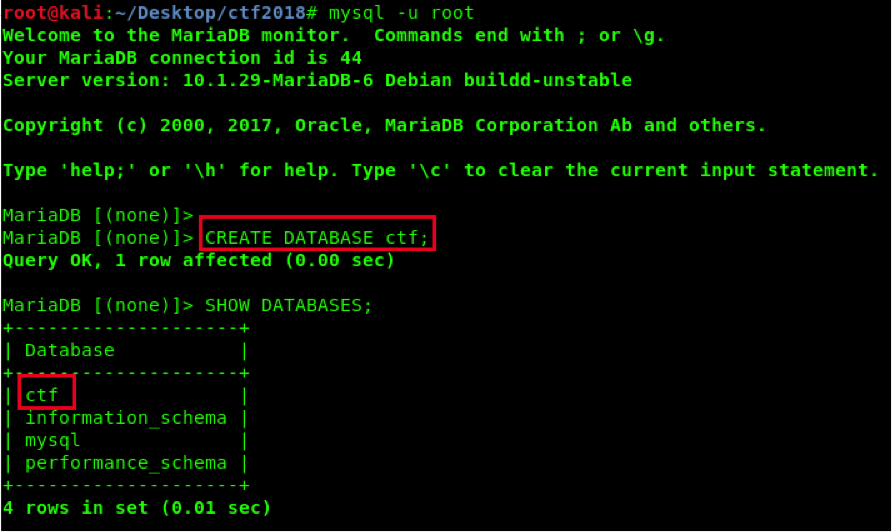
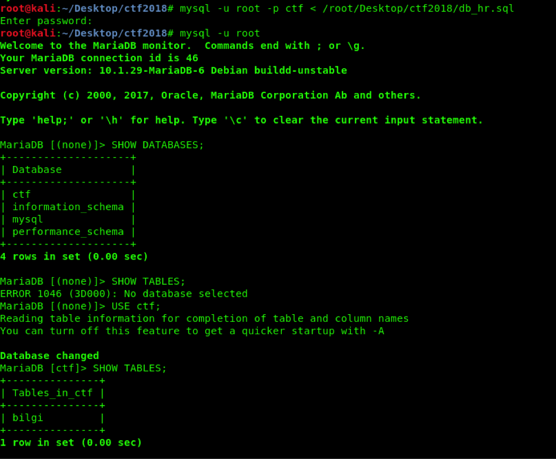
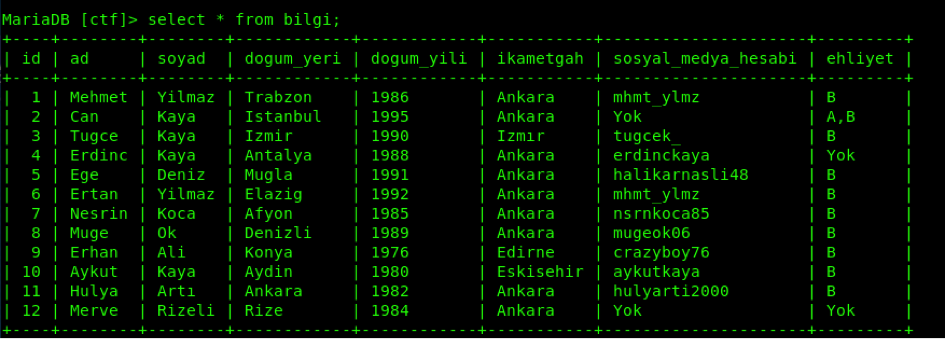
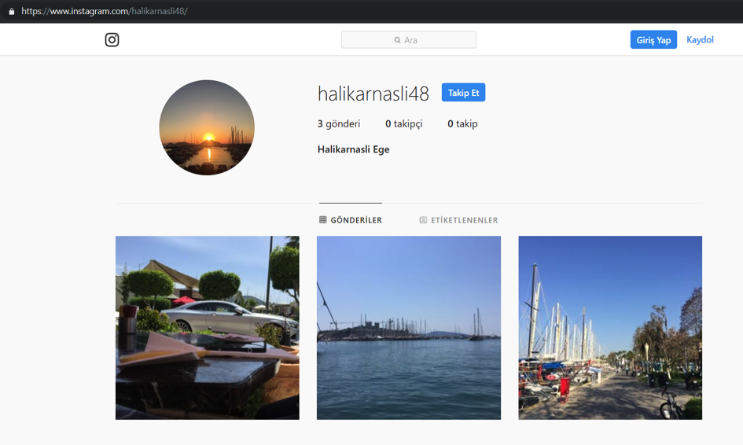
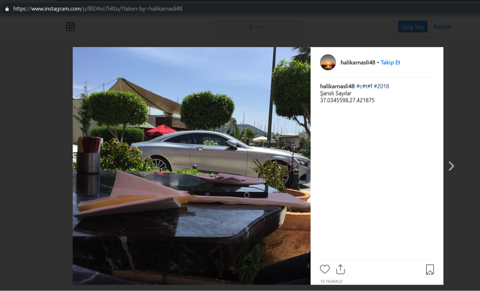
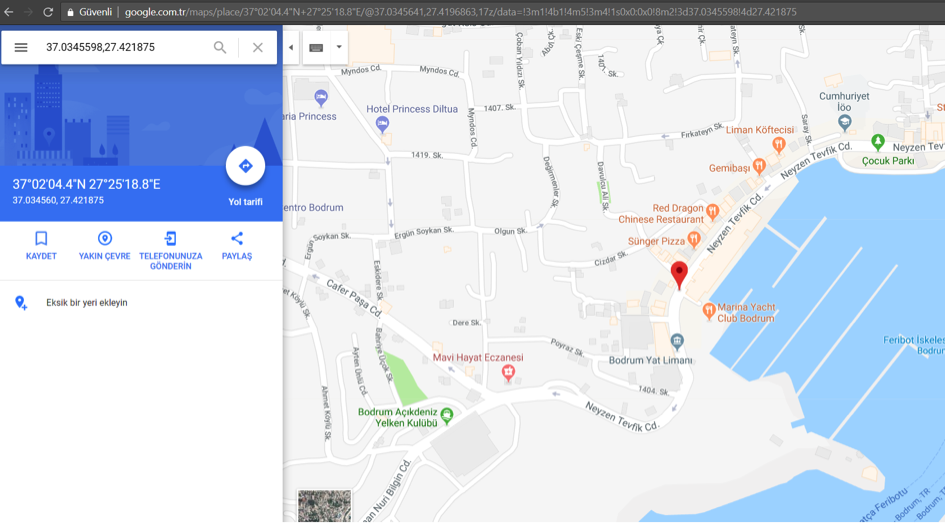
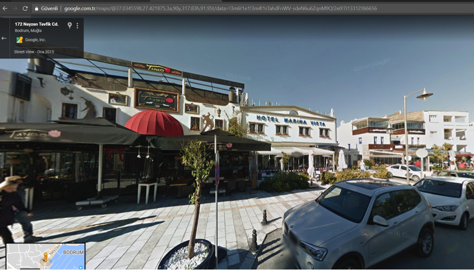
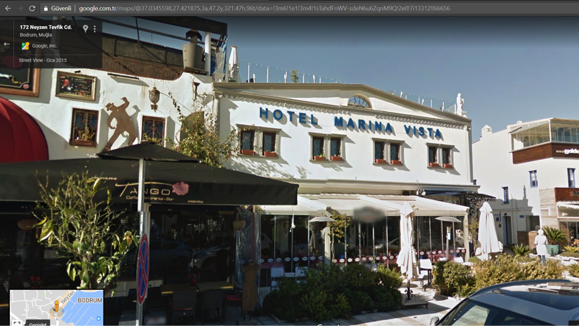

## Soru İsmi: Kaçak

## Soru Metni: 

Şirketin finans müdürü Ege Deniz önemli bilgileri şirketten kaçırdı. Hangi otelde kaldığını bulup bilgi kopyladığı usbleri almak gerekiyor. Hakkındaki bilgi dosyasını ekte bulabilirsin. Bayrak formatı STMCTF{HOTEL_*_*}

Soruda verilen dosya: [db_hr.sql](db_hr.sql)

## Çözüm: 

1. Soruda bize Ege Deniz isimli kişinin kaçtığı bilgisi ve insan kaynakları veritabanı dosyası verilmektedir. Veritabanı dosyasını açmak için mysql’de veritabanı oluşturulur.

 
2. Dosya veritabanına aktarılır. Bilgi tablosu tespit edilir.
 

3. Soruda Ege Deniz adlı kişinin kaldığı otelin bulunması isteniyor. Bunun için sosyal medya hesaplarından paylaşım yapabileceği düşünülerek ilgili kişinin sosyal medya üzerindeki hesabı araştırılır. Sosyal Medya Hesabı: halikarnasli48
 

4. Instagram üzerinde bu kullanıcı adında bir hesap tespit edilir.

5. Resimler incelendiğinde, bir gönderi dikkati çeker. Verilen sayılar koordinat bilgilerini tespit etmektedir. 

 

6. Bulunan koordinatlar haritalar üzerinden araştırılır. 
 

7. Bulunan koordinatlara sokak görünümünden bakıldığında ilgili kişinin kaldığı otelin adı bulunur. 

 

8. Hotel Marina Vista tespit edilir.

**Flag  = STMCTF{HOTEL_MARINA_VISTA}**
