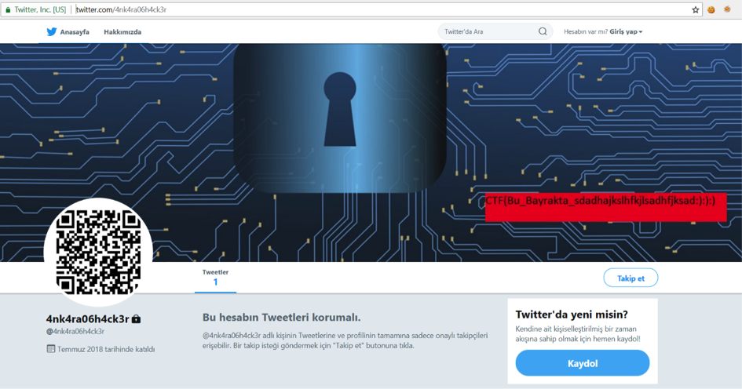
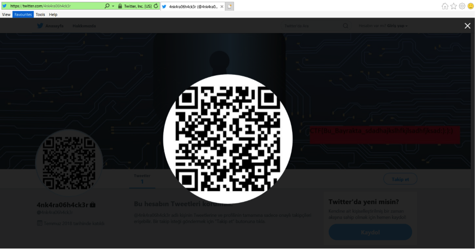
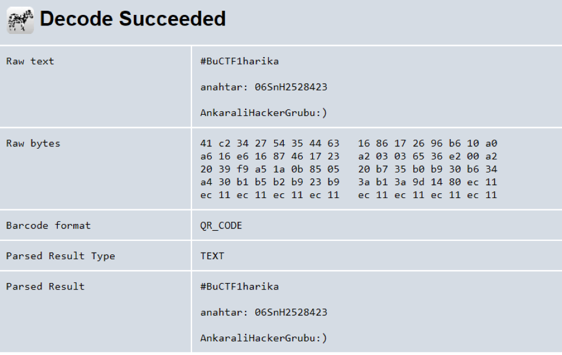
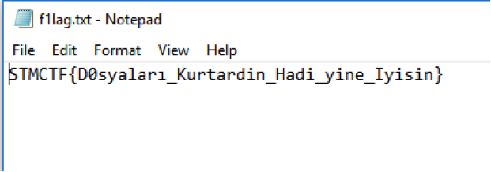

## Soru İsmi: Şifrelendik

## Soru Metni: 

4nk4ra06h4ck3r grubu tüm verilerimizi şifrelemiş. Para ödemek istemiyoruz şifreyi bulmak gerekiyor. Şifreyi bulursak önemli dosyaları kurtarabiliriz.

Soruda verilen dosya: [encrypted.rar](encrypted.rar)

## Çözüm: 

1. 4nk4ra06h4ck3r grubu verilmesiyle soru da OSINT sorusu olduğu için sosyal medya da bu kullanıcı adında hesap olup olmadığı kontrol edilir ve twitter’da kullanıcı tespit edilir.

2. Kullanıcı duvar resmi ve QR kodlu profil resmi dikkat çeker.
 

 
3. QR kod resim olarak indirilir ve decode edilip yazılanlar ve anahtar tespit edilir.
 

4. Verilen şifreli rar dosyası bulunan anahtar ile açılır.
 

5. Flag tespit edilir.
 

**Flag  = STMCTF{D0syaları_Kurtardin_Hadi_yine_Iyisin}**
