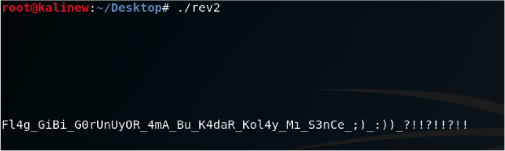
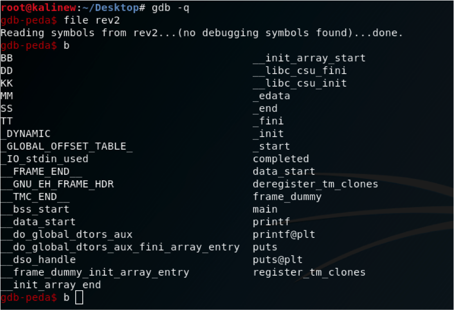
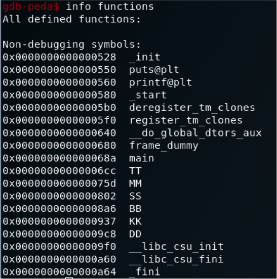
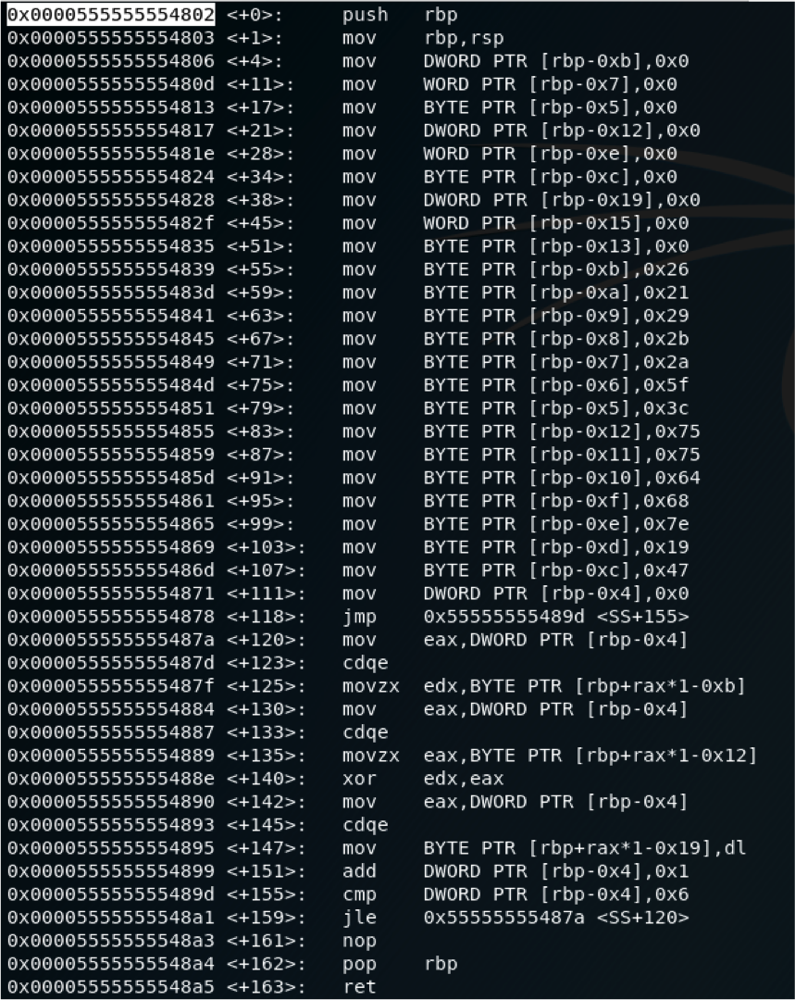
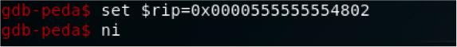
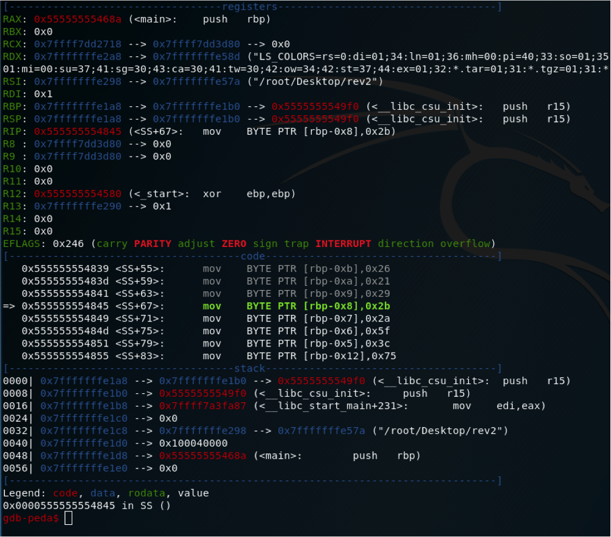
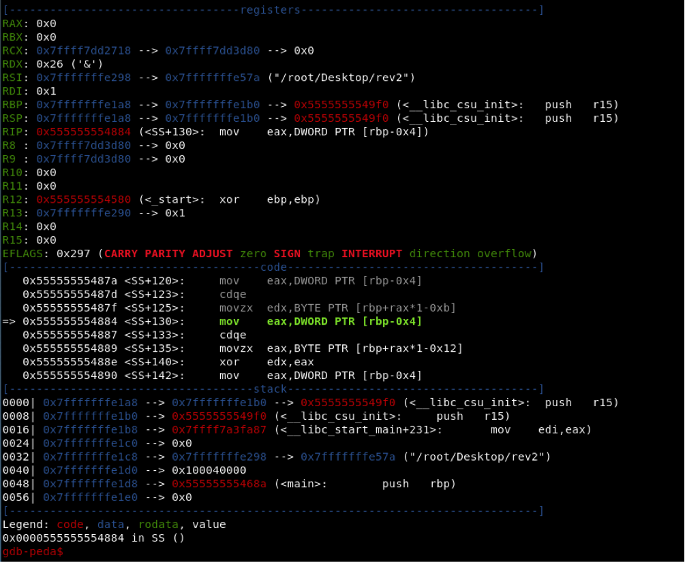
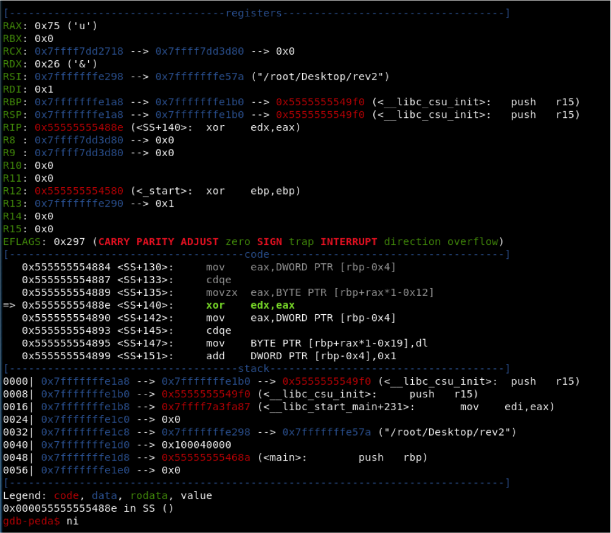
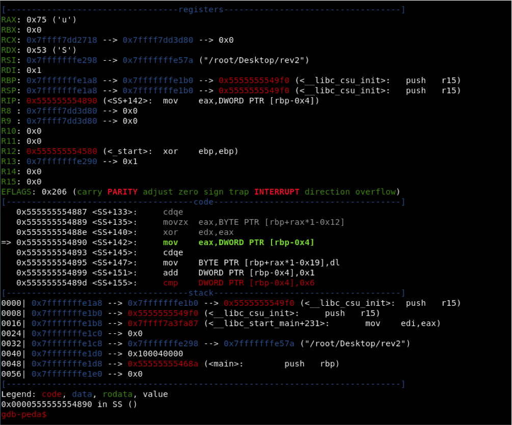
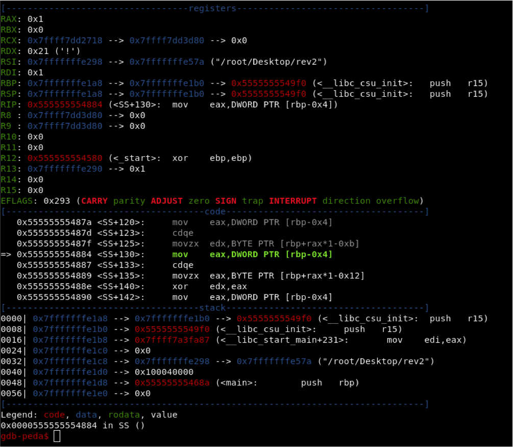

## Soru İsmi: Bunlar Bana Ters

## Soru Metni: 

Soruda verilen dosya: [BunlarBanaTers.zip](BunlarBanaTers.zip)

## Çözüm: 

1. Dosyayı incelediğimizde ELF Linux executable dosyası olduğunu görebiliriz.
Öncelikle çalıştırarak ne yaptığını anlamaya çalışalım.

2. Çalıştırdığımızda anlamlı bir şey çıkmadı.
Gdb kullanarak debug etmeye başlayalım.

3. Breakpoint koymamız gereken fonksiyonları görmek için “b” yazıp tab tuşuna basıyoruz. Fonksiyonlara baktığımızda anlamlı bir isimde olmayan 6 fonksiyon görüyoruz.

4. Verilen hintlerden hareketle “STM” harflerinden oluşan fonksiyonlara bakmamız gerektiği anlaşılıyor. Eğer anlaşılmazsa her fonksiyonu tek tek incelememiz gerekecektir. İncelemeye SS adlı fonksiyondan başlıyoruz.

5. Fonksiyonu disassemble ettiğimizde birtakım atama işlemlerinin hex değerler üzerinden yapıldığını görebiliyoruz. Hatta XOR işlemini bile görebiliriz. Disassemble ettiğimizde anlamlı bir şeyler göremediğimizi düşünürsek dinamik analiz ile kolay bi şekilde neler olup bittiğini inceleyebiliriz. Öncelikle fonksiyonun başlangıç adresini kopyalayıp “rip” instruction’ı üzerine set ediyoruz.
  

6. Fonksiyona atladığımızda :

7. Instructionları tek tek işleterek fonksiyonun ne yaptığını anlamaya çalışıyoruz. Atama işlemlerini burada rahatlıkla görebiliriz. Fonksiyonu incelemeye devam ettiğimizde RDX register’ına ascii bir değer atandığını görüyoruz.

8. Daha sonra RAX’a atanan bir değer ile RDX’e atanan değerin XOR işlemine tabi tutulduğunu görüyoruz.

9. XOR işlemi sonucunda karşımıza ‘S’ değeri çıkıyor. Burası flag değerinin başlangıç noktasıdır.

10. Daha sonradan RDX register’ına sırasıyla XOR işlemi için gereken değerleri veriyor ve XOR işlemi sonucunda “SS” fonksiyonu içinde flag değerini oluşturan 3 parçadan ilkini ortaya çıkartmış oluyor.

11. STM harflerinin sırasına uygun olarak “SS”, “TT”, “MM” fonksiyonları incelediğimizde ortaya çıkan flag parçaları aynı şekilde XOR işlemiyle ortaya çıkmış oluyor. 

**Flag  = STMCTF{p4RaMp4rCa_OLdUm}**
