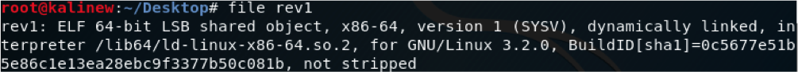
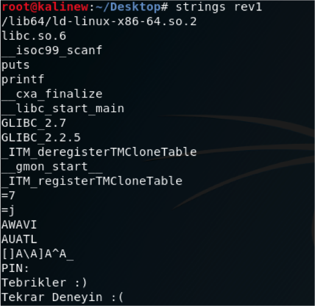
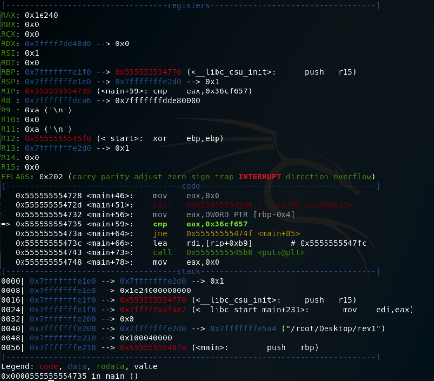
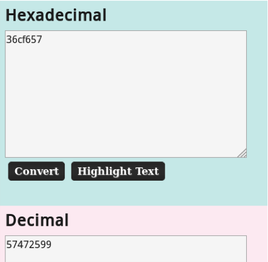

## Soru İsmi: PIN KODU

## Soru Metni: 

PIN kodunu bulabilir misin? Bulunan PIN kodu flag formatı içerisine yerleştirilmelidir.

Soruda verilen dosya: [PINkodu.zip](PINkodu.zip)

## Çözüm: 

1. Soruda verilen dosyanın özelliklerini görebilmek adına file komutunu kullanıyoruz. Dosyanın ELF 64-Bit dosyası olduğunu görüyoruz. 

2. Programı incelemeden önce çalıştırıp programın işleyişi hakkında bilgi sahibi olmamız gerekir.

3. Program hakkında bilgi sahibi olabilmek için stringlerine de bakmamız gerekir.

4. Program bizden PIN kodu istiyor. PIN kodunun doğru olup olmadığı ile ilgili bir kontrol olduğunu düşünüyoruz. Tebrikler ifadesi bu düşüncemizi destekler niteliktedir. Fakat yine de analiz etmeden kesin olarak bu şekilde diyemeyiz. Artık inceleme kısmına geçebiliriz. İnceleme kısmında disassembler veya debugger kullanılabilir. GDB ile executable dosyamızı incelediğimizde PIN kodunun scanf fonksiyonu ile kullanıcıdan alındığını görüyoruz ve sonrasında CMP instruction’ı hexadecimal bir değer ile karşılaştırma yaptığını tespit ediyoruz.

5. 0x36cf657 değerinin decimal karşılığı PIN kodudur.Hexadecimal değeri decimal değere çeviriyoruz.

**Flag  = STMCTF{57472599}**
