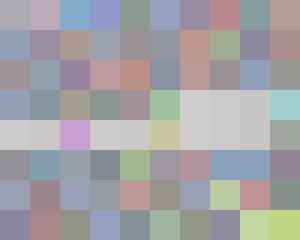

## Soru İsmi: Rengarengk String
Hazırlayan: [penny](https://github.com/pennylaneparker)
## Soru Metni: 

Bu sene de renkli bir soru sormazsak olmaz. Renklerin kodlarını bul sana bir şey ifade edeceklerdir.



## Çözüm: 

1. Her kutucuktaki RGB değerini decimal olarak okuyoruz. (172, 171, 178) deki her degeri 255 le XORlayıp hexadecimal e çeviriyoruz.
ASCII olarak yazdığımızda flag geliyor.

2. Aşağıdaki script yazılarak flag elde edilir.

```python
import binascii
import sys
from PIL import Image, ImageFont, ImageDraw, ImageEnhance

im = Image.open("rengarenk_string.png")
pix = im.load()

flag=""

for j in range(0,8):
	for i in range(0,10):
		color=pix[i*30,j*30] #Get the RGBA Value of the a pixel of an image
		flag=flag+''.join(chr(c^255) for c in color)
print flag
```


`FLAG = STMCTF{R3ng4renk_Bir_Dunya_Icin_Her_Sene_Renkli_Bir_Soru_Soralim_Siz_De_Cozun_Eglenin_Dedik_Iyi_Yaptik_mi_?_123456789_123456789_123456789_123456789_Yalniz_Ne_Uzun_Flag_Oldu_Bu_Boyle_Neyse_Hic_Degilse_MD5_Aliyoruz_Uzunluk_Ayni_Kaliyor_;)_:)}`
