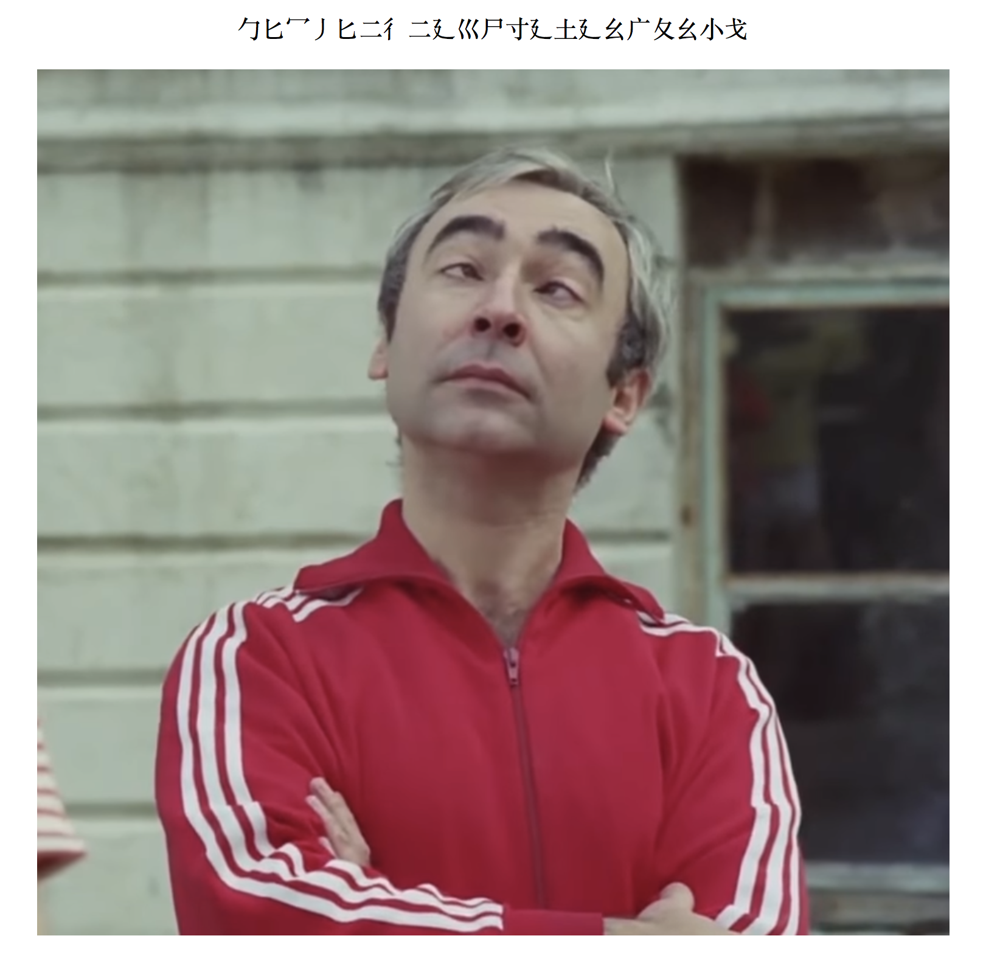
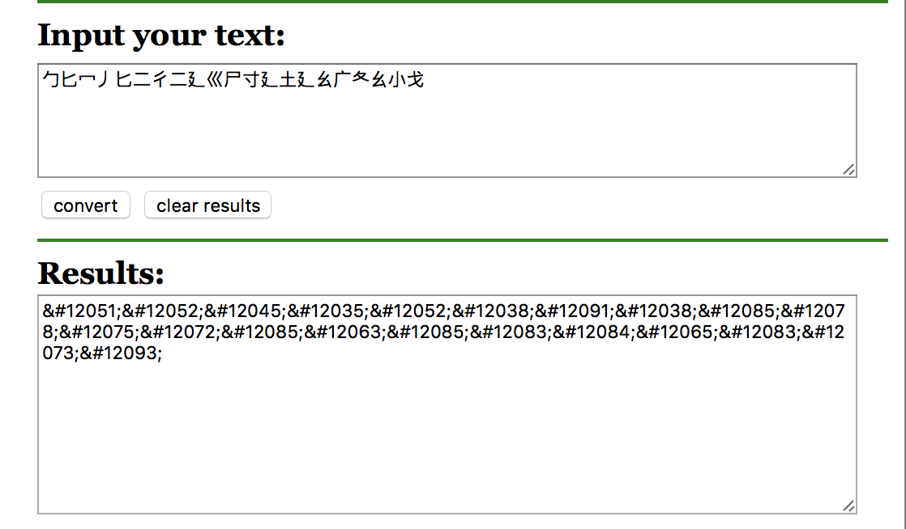

## Soru İsmi: Badi

## Soru Metni: 

Ne diyo bu?

## Çözüm: 

1. Çince karakterler ile gösterilen yazı aslında flag. Karakterler aynı miktarda shift edilerek Çince karakterlere dönüştürülmüş.

2. Çince karakterleri unicode a çeviriyoruz.

⼓⼔⼍⼃⼔⼆⼻⼆⼵⼮⼫⼨⼵⼟⼵⼳⼴⼡⼳⼩⼽

\&#12051;\&#12052;\&#12045;\&#12035;\&#12052;\&#12038;\&#12091;\&#12038;\&#12085;\&#12078;\&#12075;\&#12072;\&#12085;\&#12063;\&#12085;\&#12083;\&#12084;\&#12065;\&#12083;\&#12073;\&#12093;

3. Flag formatından yola çıkarak ilk karakter (&#12051)  ile S harfinin Unicode değerleri (&#83) arasındaki fark (12051 - 83 = 11968) kadar bütün karakterleri shift edince Flag elde ediliyor.

**FLAG = STMCTF{Funkhu_ustasi}**
