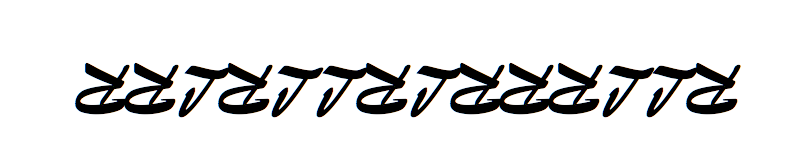

## Soru İsmi: On Parmak

## Soru Metni: 

STMCTF{JWUVPSEFXUOJRE}

## Çözüm: 

Resim dikkatli incelendiğinde RRLRLLRLRRRLLR harf dizisi olduğu gözükür. 
Dizi Word uygulamasında Brush Script fontu ile yazılıp, ters çevrilmiştir. 
Metindeki harflerin klavye üzerinde sağa (R) ya da sola (L) kaydırılmasıyla metin çözülür. 

**FLAG = STMCTF{JWUVPSEFXUOJRE} --> STMCTF{KEYBOARDCIPHER}**
