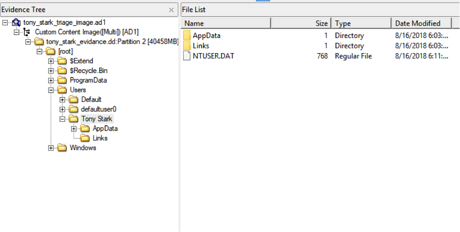
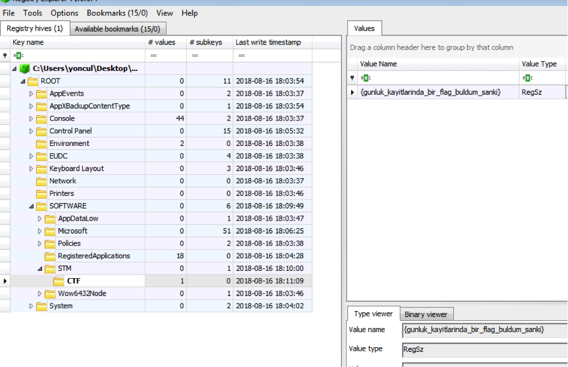

## Soru İsmi: Demir Adamın Günlükleri

## Soru Metni: 

Demir adamın kayıt defterinde beklenmeyen değerler var. Kayıtları analiz ederek bayrağı yakalayabilecek misin?

Soruda verilen dosya: tony_stark_triage_image.zip

## Çözüm: 

1. tony_stark_triage_image.ad1 dosyası FTK Imager ile açılır. 
Guest makinenin sistem dosyaları incelenerek  NTUSER.DAT registry hive dosyası extract edilir.   

2. Registry explorer vasıtasıyla extract edilen dosya, host makinede açılır. 
Yazılımlar sekmesinde STM ve içerisinde CTF kayıtları görülür.  Kayıt isminde flag değerine ulaşılır.   

**Flag: STMCTF{gunluk_kayitlarinda_bir_flag_buldum_sanki}**
