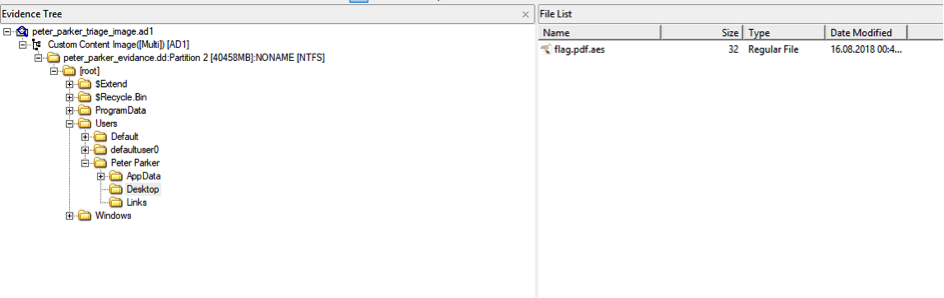
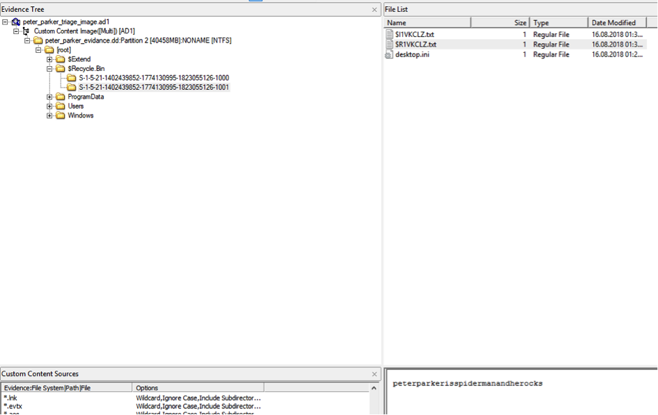

## Soru İsmi: Örümcek Analiz

## Soru Metni: 

Peter'in bilgisayarı ele geçirildi. Bayrağı yakalayıp şifreyi çözebilecek misin?

Soruda verilen dosya: peter_parker_triage_image.ad1

## Çözüm: 

1. peter_parker_triage_image.ad1 dosyası FTK Imager ile açılır. Masaüstünde şifrelenmiş flag dosyası bulunur.  

2. Geri dönüşüm kutusunda password dosyasında şifre bulunur AES decryption yapılarak soru çözülür.  

**Flag: STMCTF{Parcacik_da_olsa_yakalariz}**
