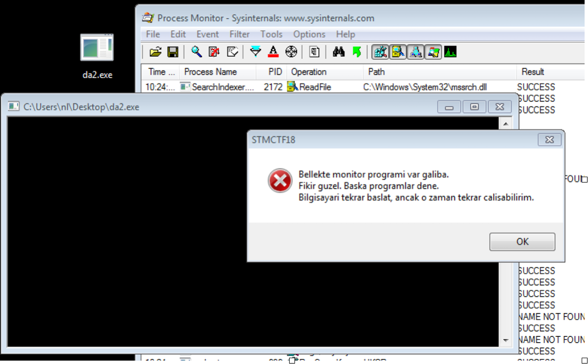
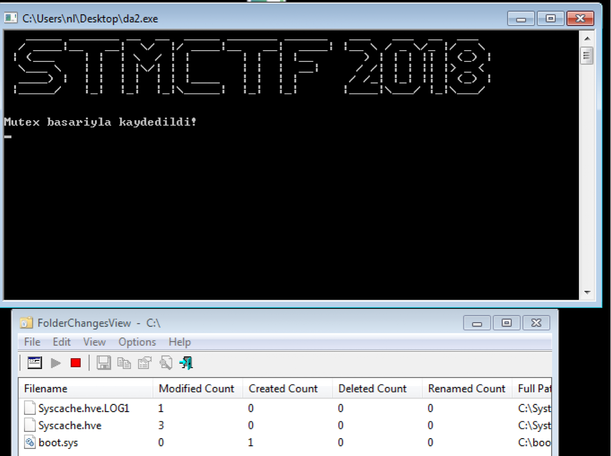
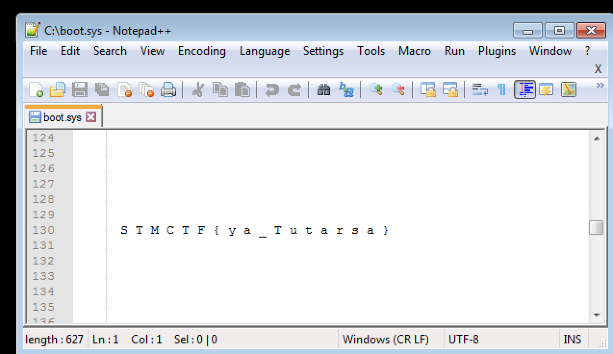

## Soru İsmi: DA2

## Soru Metni: 

Zararlı yazılım bilgisayarına MUTEX bırakıyor. FLAG  bu Mutex’te.

Soruda verilen dosya: [da2.zip](da2.zip)

## Çözüm: 

1. Dosyanın admin olarak çalıştırılması gerekiyor. Soruda ve dosya çalıştırıldığında Mutex bıraktığını söylüyor. 
Registry yerine işletim sistemine bir dosyayaya yazıldığı anlaşılıyor. 
Procmon gibi bir yazılım ile çalışan programı incelemek istediğimizde anti-debug özelliğinin programda olduğunu görüyoruz. 
Farklı programlar ile bu anti-debug'dan kaçmaya çalışıyoruz. 

2. Program tekrar çalıştırıldığında 5 dakika beklenince mutex'i sileceği belirtiliyor. 
Deneme öncesinde 5 dakika beklenebilir veya program çalıştırılmadan önce sanal bilgisayarın snapshot ı alınarak tekrar deneme yapılabilir.

3. [FolderChangesView](http://www.nirsoft.net)  programı ile C sürücüsü izlenirken program çalıştırıldığında 
c:\boot.sys dosyasının oluşturulduğu gözüküyor. Dosyanın içerisine bakıldığında boot loader olduğu gözüküyor 
ancak dosyanın boş satırlar ile dolu olduğu da anlaşılıyor.  Dosyanın ortalarında S T M C T F { y a _ T u t a r s a } görülüyor. 
Boşluklar alındığında, **FLAG = STMCTF{ya_Tutarsa}** bulunuyor.

