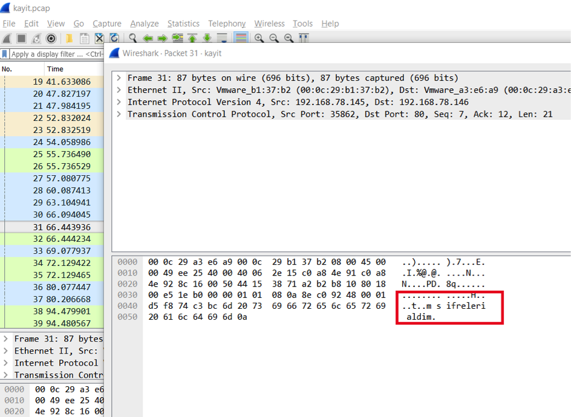
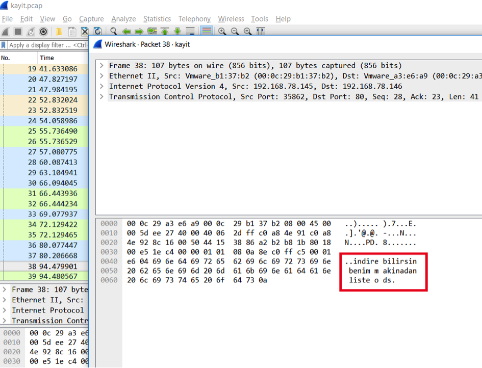
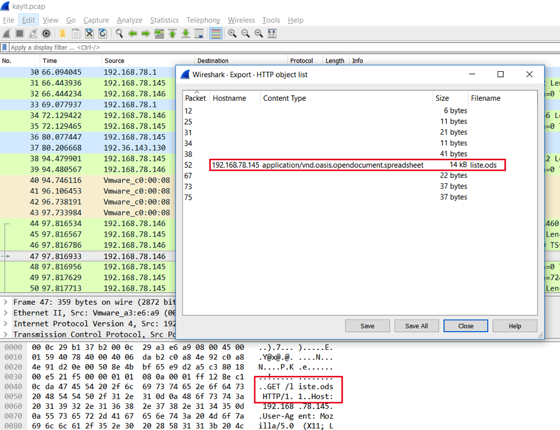
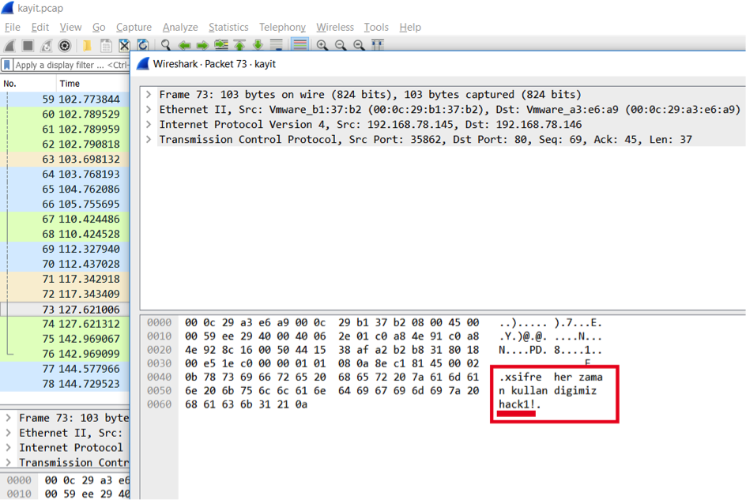
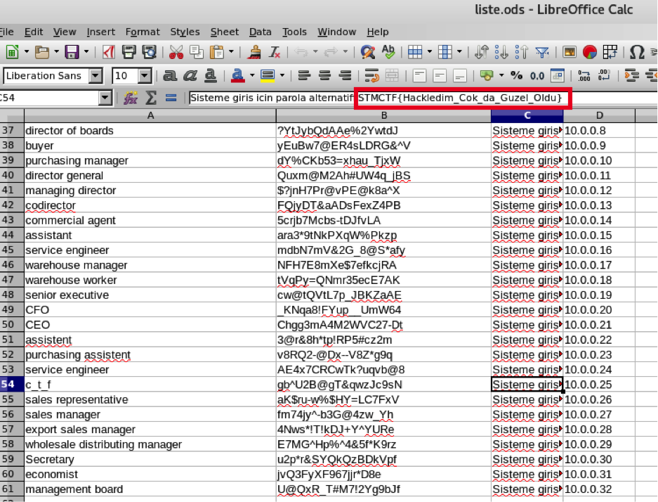

## Soru İsmi: H4ckl3nd1k

## Soru Metni: 

Şirketin ağına saldırganlar girdi, ağ kaydımızı analiz ederek hangi bilgileri tespit ettiklerini bulmak gerekiyor.

Soruda verilen dosya: [kayit.pcap](kayit.pcap)

## Çözüm: 

1. Verilen pcap kaydı açılır. Kayıtlarda bulunan tcp paketleri incelenir ve bir yazışma tespit edilir.
 

2. Yazışmada bir dosyanın indirilebileceğinden söz etmektedir. 

 

3. liste.ods dosyası wireshark’tan export edilerek indirilir.

4. liste.ods dosyasını açmak için şifre gerekmektedir. Ağ kayıtları incelenmeye devam ettiğinde şifrenin *hack1!* olduğu bulunmaktadır.

 

5. Dosya bu şifre ile açılınca  ctf satırı açıklamalarında bayrak bulunur.

**FLAG = STMCTF{Hackledim_Cok_da_Guzel_Oldu}**

