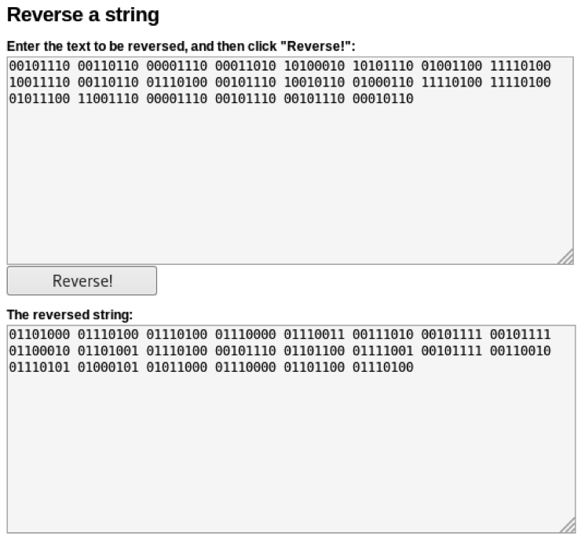
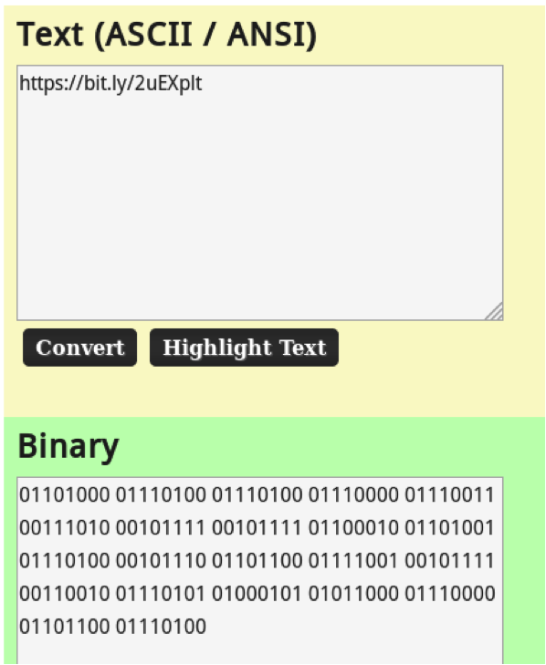
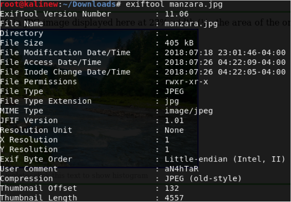
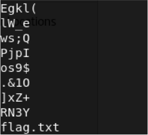
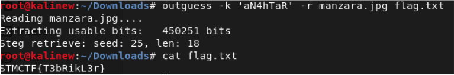

## Soru İsmi: Manzara

## Soru Metni: 

Manga okur gibi oku bakalım ne bulacaksın.

00101110 00110110 00001110 00011010 10100010 10101110 01001100 11110100 10011110 00110110 01110100 00101110 10010110 01000110 11110100 11110100 01011100 11001110 00001110 00101110 00101110 00010110

## Çözüm: 

1. İlk olarak ikili sistemde bulunan ifadenin anlaşılabilir şekle dönüştürülmesi gerekli. Olduğu haliyle dönüştürdüğümüz zaman anlamlı bir ifade çıkmıyor. Binary ifadenin string reverse yöntemiyle dönüştürülebilecek hale getirilmesi gereklidir. Reverse string işlemi için python kodu yazılabilir veya bu işlemi yapan websiteleri kullanılabilir.(http://string-functions.com/reverse.aspx)

2. Ortaya çıkan binary ifade okunabilir hale getirilmelidir. https://www.asciitohex.com websitesi kullanılabilir.

3. Karşımıza çıkan https://bit.ly/2uEXplt linkine tıkladığımızda indirmemiz gereken dosyaya yönlendirme yapılıyor. http://s3.dosya.tc/server16/xngtvv/manzara.zip.html

4. manzara.jpg dosyasının exif bilgilerini incelemek için exiftool kullanıyoruz. Exif bilgilerini incelediğimizde “aN4hTaR” kullanıcı yorumu dikkatimizi çekiyor.

5. Dosyanın stringlerine baktığımızda stringlerin son satırında ipucu olması adına verilen “flag.txt” yi görüyoruz.

6. Paylaşılan ipuçlarından hareketle yaptığımız araştırma sonucunda OutGuess kullanılarak jpg dosyası içine flag.txt gömüldüğü sonucuna varıyoruz. OutGuess aracını kullanarak flag.txt dosyasını export ediyoruz.

