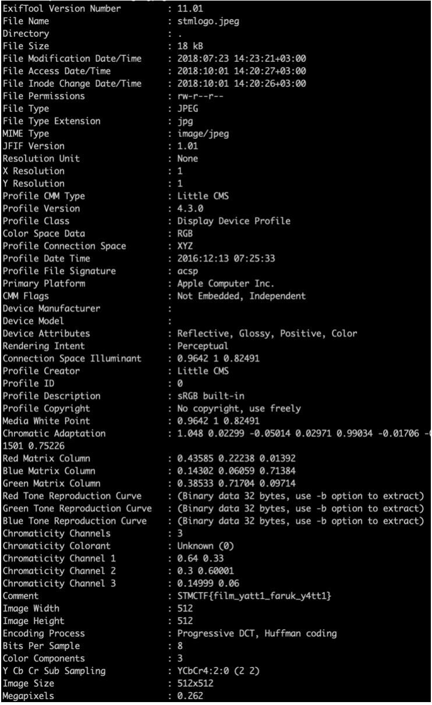

## Soru İsmi: STMLogo
Hazırlayan: [mertcan](https://twitter.com/mertcancoskuner)
## Soru Metni: 

Bayrak resmin içinde.

## Çözüm: 

JPEG dosyasının bilgilerine exiftool ile bakılarak bayrak bulunmaktadır.

**Flag = STMCTF{film_yatt1_faruk_y4tt1}**
