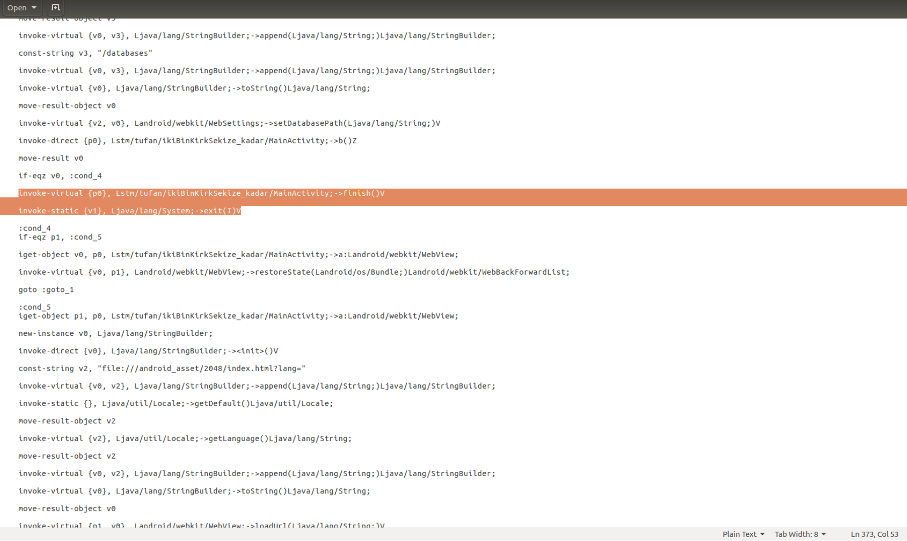

## Soru İsmi: İKİ BİN KIRK SEKİZE KADAR
Hazırlayan: [tufan](https://twitter.com/osmantufantekin)
## Soru Metni: 

Oyunu oynarken flagi bul. Arada yanmayı unutma!

Soruda verilen dosya: [ikiBinKirkSekize_kadar.apk](ikiBinKirkSekize_kadar.apk)

## Çözüm: 

1. Soru içerisinde emulator kontrolü yapılmaktadır. İlk aşamada o emulator kontrolünün geçilmesi gerekmektedir. 
Bunun için kodun smali’si üzerinde emulator kontrolü yapıldığı yerin kaldırılıp tekrar build edilmesi gerekmektedir. 
Bu kontrol kaldırılmadan soruya devam edilemez çünkü sorunun içerisinde yer alan index.html dosyası çalıştırdığı zaman arkada 
çalışan scriptte Browser kontrolü yapılmaktadır. Browser üzerinde çalışma yapılamayacağı için emulator kontrolünü kaldırılması gerekir. 

2. Tekrar build edilen uygulama çalıştığı zaman her puan kazanıldığında şifrelemenin AES algoritmasıyla ve CBC modda yapıldığı oyun 
ekranında görülmektedir. Ardından key 4’er byte şeklinde ekrana basılır ancak puan aralığı çok yüksek olduğu için bütün byte’ları 
oradan yakalamak zordur. Ayrıca IV’de aynı şekilde ekranda 4’er byte şeklinde gösterilmektedir. Gösterilen byte’lara ulaşmak için 
uygulamanın kodu incelenir. Webview üzerinde çalışan uygulama arkada javascript çalıştırmaktadır. 

3. Oyun sonuna gelindiğinde şifreli bir metin “TRY AGAIN” arkasında görülmektedir.Ancak 2 Byte görülmemektedir.

4. JavaScript koduna bakıldığında(html_actuator.js) obfuscation uygulandığı görülmektedir. Online bir beautifier kullanılarak key ve iv’nin byte array’lerine ulaşılır. 

5. Key ve IV’ye ulaşıldıktan sonra geriye son kısmında çıkan ve 2 byte eksik olan cipher’ı tamamlamak kalıyor. CSS üzerinden butona karşılık gelen objenin opasity’ini sıfıra çektiğimiz zaman metninde tamamı görülebilmektedir.

6. Ardından bulunan IV, key ve şifreli metin ile şifre çözülür ve flag’e ulaşılmış olur.

**Flag: STMCTF{Her_s3yiN_1_Ilk1_V@rdiR}**
