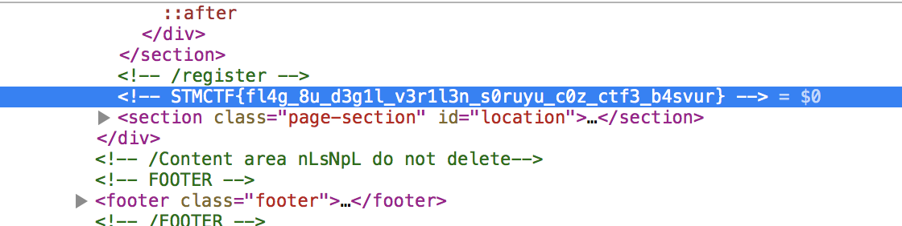

## Soru İsmi: Bu Sene Flag Oldu
Hazırlayan: [penny](https://github.com/pennylaneparker)
## Soru Metni: 

Geçen seneki CTF'e kayıt olanlar bilir, kayıt için bir sorumuz vardı. Ama o soru yerine flag gibi görünen ama flag olmayan bir değer vardı. İşte bu sene o gerçek flag :)

## Çözüm: 

archive.org sitesi kullanılarak https://web.archive.org/web/20171009130609/https://ctf.stm.com.tr/ adresindeki 2017 senesindeki siteye gidilirse source kodunda flag görülüyor.

**FLAG = STMCTF{fl4g_8u_d3g1l_v3r1l3n_s0ruyu_c0z_ctf3_b4svur}**
