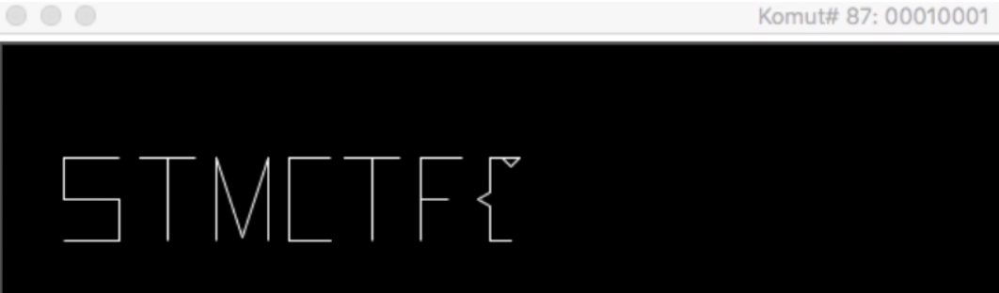
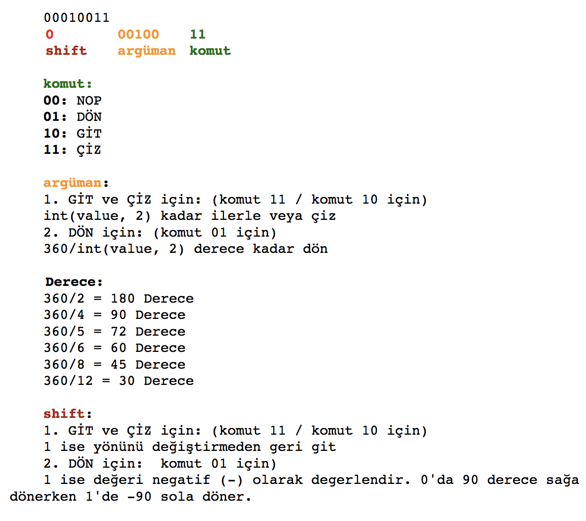
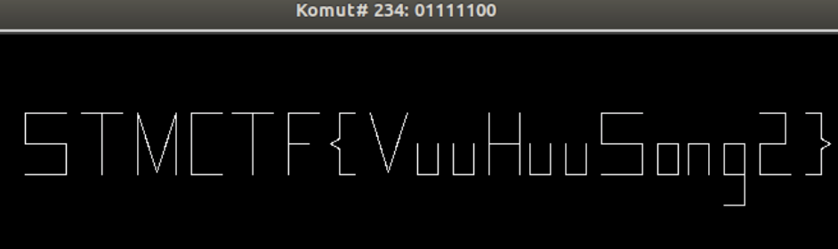

## Soru İsmi: 8bitKaplumbagaCNC

## Soru Metni: 

Canım Kaplumbağam,

Hazırlan. Önce düz bir çizgi çiz. Devamına aynısından tekrar yap. Sola dön, bir düz çizgi daha çiz. 
Sola dön ve iki çizgi daha. Sağa dön tekrar çiz ve son olarak sağa dön iki kez daha çiz. S harfi tamam.

Öptüm. Kib. Bye.

Soruda verilen dosya: [8bitKaplumbagaCNC.zip](8bitKaplumbagaCNC.zip)

## Çözüm: 

1. Bu sorunun çözümü için 8bitKaplumbagaCNC.mov videosunda 8bitKaplumbagaCNC.cmd’da bulunan ilk 90 ve son 16 komutun görsel 
olarak gösterilmesi kullanılabilir.

2. Her bir komutun 1 byte/8 bit olduğu görülüyor. Burada gözler kör olana kadar bu 8 bit’in neresi komut, 
neresi argüman bunların bulunması ve sonra da her bir komut ve argümanın anlamlandırılması, 
sonra da yazılacak kod ile flag’ın bulunması olacaktır. Böyle anlatınca kolay da, gel bunu bi de bize sor diyeceksiniz. :) 

3. Çözüm için hazırlanan [solution.py](solution.py) scripti çalıştırıldığında Flag, **STMCTF{VuuHuuSong2}** olarak ekranda okunuyor.

