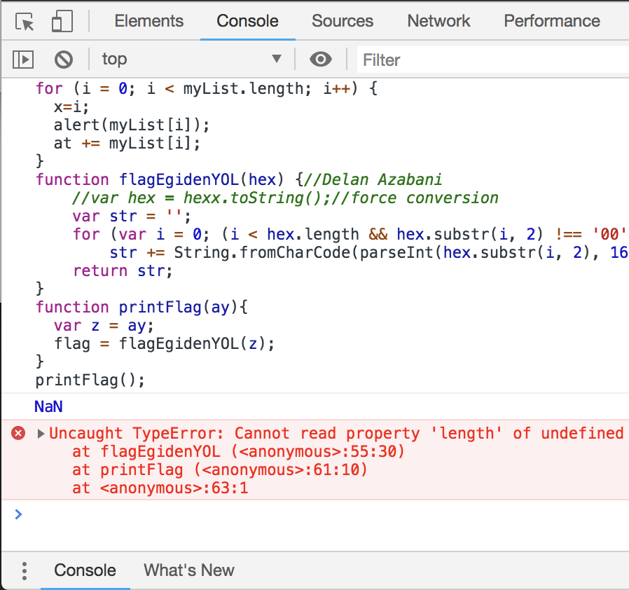
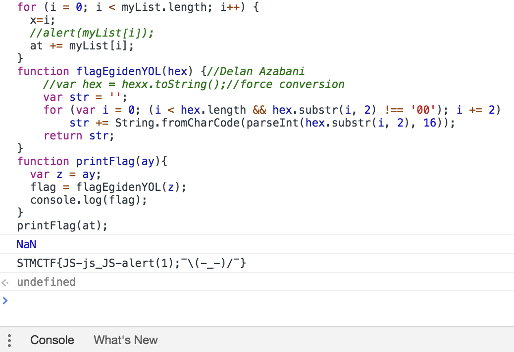

## Soru İsmi: JoS-Beni

## Soru Metni: 

JS debug kolaydir, tabi hata yoksa.

Soruda verilen dosya: [yy.js](yy.js)

## Çözüm: 

Verilen javascript kodunun son satirinda hata oldugu icin calistirmak istedigimizde calismayacaktir.

Hata arastirildigi zaman printFlag() fonksiyonunun parametre bekledigi icin oldugu ortaya cikmaktadir. Kod icerisinde yer alan flagin olusup toplandigi degiskenin (at isimli degisken) printFlag fonksiyonuna girdi olarak verdigimiz zaman calisacaktir. Bu durum, kodun incelenmesi ile anlasilmaktadir.
Ancak hala flag ekrana basilmamaktadir. Bunun icin printFlag fonksiyonu icerisinde son satira, console.log(flag); yazilmasi gerekmektedir. Boylelikle kod calisarak flagi ekrana basacaktir.

Duzenlenmis kod: [yy-cozum.js](yy-cozum.js) dosyasinda yer almaktadir.

**Flag = STMCTF{JS-js_JS-alert(1);¯\(-_-)/¯}**

