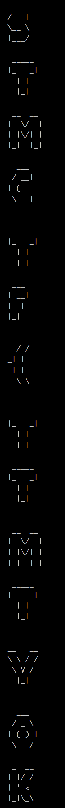

## Soru İsmi: KAYNAK KODU BENDEN

## Soru Metni: 
flag.txt'yi okudum, cikti.txt'yi oluşturdum. Peki sen cikti.txt'yi okuyup, flag.txt'yi oluşturabilir misin?

Soruda verilen dosya: [KaynakKoduBenden.zip](KaynakKoduBenden.zip)

## Çözüm: 
Kaynak kodunu okuyan bir kisinin: generateFlag.py dosyasi icerisinde flag.txt'nin okundugunu ve daha sonra her satira 0x01 eklenerek ekrana basildigini anlamasi gerekmektedir.

Ayni kodun tersini yazarak,
cikti.txt'yi okuyan ve butun hex degerlerinden 0x01 cikaracak bir scriptin yazilmasi gerekmektedir. Bu script sonucunda flag.txt olusmaktadir.

```
import binascii

lines = [line.rstrip('\n') for line in open('cikti.txt')]
newList=[]
for byte in lines:
    result = hex(int(byte, 16) - int("0x01", 16)) #hex 0x01 cikarma islemi
    hexWithout0x = result[2:].zfill(2)#fill with zeros
    newList.append(hexWithout0x)#listeye ekle
    bytes = binascii.a2b_hex(''.join(newList))
print bytes
```



**Flag = STMCTF{TTMTYOKBAMBAMBAM}**
