## Soru İsmi: MATRUŞKA

## Soru Metni: 

Bul parolayı al flag’i 

Soruda verilen dosya: [matruska.zip](matruska.zip)

## Çözüm: 

1. rev.zip dosyası içerisinden rev.exe dosyası çıkmaktadır. Dosyanın tipine bakıldığında 32-bit Windows çalıştırılabilir dosyası olduğu görülmektedir ve kullanıcıdan doğru parolayı girip 
flag’i bulması beklenmektedir.

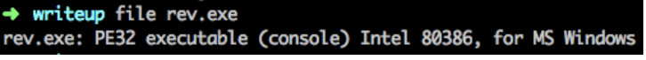

2. Dosya, PE editor araçları ile incelendiğinde veya içerisindeki stringlere göz gezdirildiğinde python27.dll vb. 
stringler dikkat çekmektedir. Bu noktada dosyanın bir python uygulaması olduğu ve exe olarak paketlendiğinin anlaşılması beklenmektedir.

3. Python uygulamalarını exe dosyası olarak paketleyen araçlar incelenip CTF sorusunun hangi araç ile paketlendiğinin anlaşılması ve 
paket içerisindeki python bytecode’un çıkarılması gerekmektedir. rev.exe, PyInstaller aracı ile paketlenmiştir. 
Paket içeriğini dışa aktarmak için pyinstxtractor aracına ihtiyaç vardır.

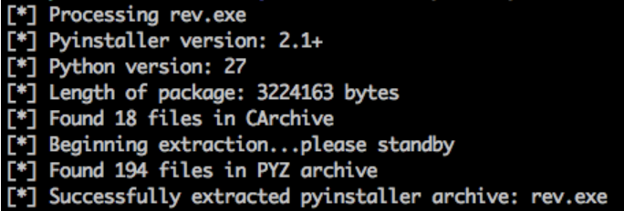

4. Paket içeriği aşağıdaki gibidir :

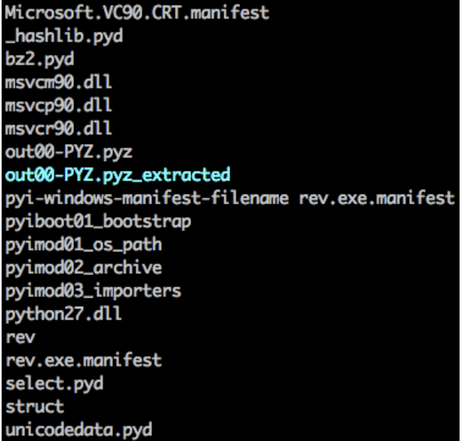

5.  rev dosyası, rev.pyc dosyası olarak herhangi bir python decompiler aracına girdi olarak verilerek python kodunun elde edilmesi 
beklenmektedir.

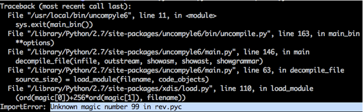

“Unknown magic number” hatası dikkat çekmektedir. Decompile aracı bilinmeyen magic number sebebi ile uygulamanın kaynak koduna erişemedi.

6. Paket içerisindeki bytecode ların yer aldığı herhangi bir dosyaya (abc.py) hex editor yardımıyla bakıldığında ilk 
8 byte’ın eksik olduğu görülmektedir.

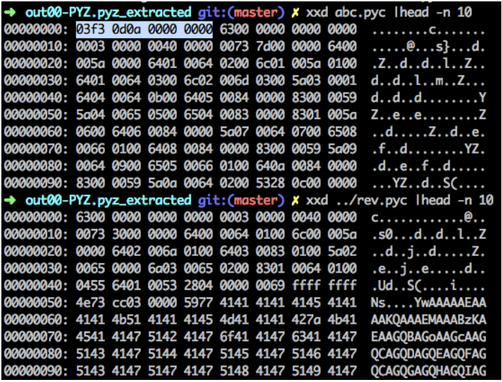

Python bytecode (pyc) yapısı incelendiğinde ilk 4 byte’ın py magic number ve sonraki 4 byte’ın timestamp bilgisi olduğu bilinmektedir. 

7. rev.pyc dosyasına ilgili 8 bytelık header bilgisi eklendikten sonra yeniden python decompiler aracına girdi olarak verilmesi 
gerekmektedir. Ardından rev.pyc dosyasına ait python koduna aşağıdaki şekilde ulaşılacaktır. 

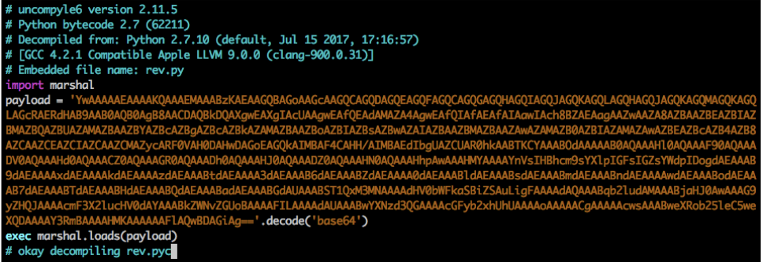

8. Kaynak kod incelendiğinde marshal kütüphanesi kullanılarak dump’ı alınmış bir payload olduğu ve base64 olarak encode edildiği görülmektedir. 
Exec komutu ile de payload içerisinde yer alan python kodu çalıştırılmaktadır.

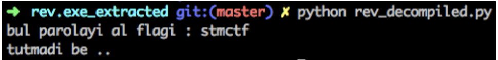

9. Gömülü python kodunu çıkartmak için marshal kütüphanesinin dump fonksiyonu kullanılarak payload verisinin dump edilmesi gerekmektedir. 
Bunun için aşağıdaki kod satırını kaynak koda ekleyip çalıştırmak yeterli olacaktır.

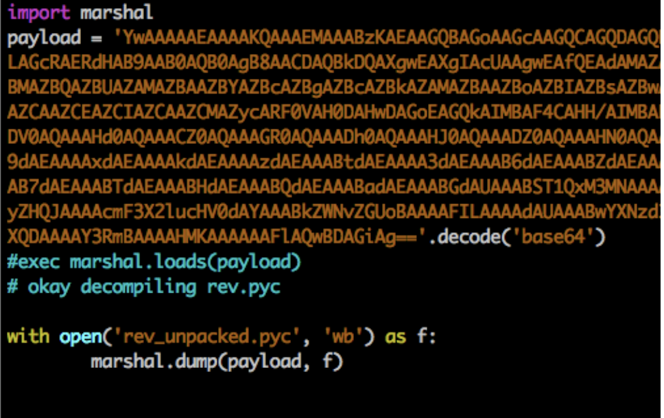

10. Dump edilen python bytecode dosyası decompiler aracına verildiğinde “Unknown magic number” hatası ile karşılaşılmaktadır. 

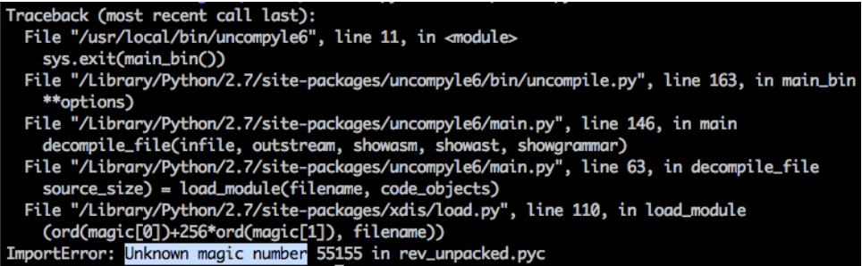

11. 6.aşamadaki yöntem kullanılarak headerlar üzerinde aynı şekilde değişiklik yapılması gerekmektedir. 

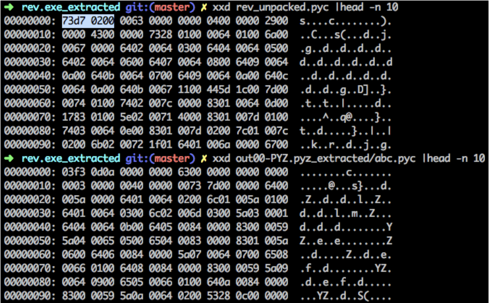

Unpack edilmiş bytecode dosyasının headerları incelendiğinde ilk 4 python magic number byte’ının farklı olduğu ve sonraki 
4 byte’ın eksik olduğu görülmektedir. 

12. İlgili header bilgileri tekrar düzenlendikten sonra dosya aşağıdaki şekilde olacaktır.
Bu noktada ek olarak dikkat edilmesi gereken yer 1 byte lık kısmın farklı olduğu ve silinmesi gerektiğidir. 
Aksi takdirde decompile işlemi yine başarısız olacaktır. 

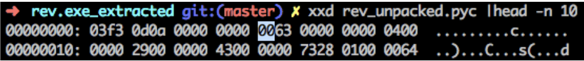

13. İlgili dosya decompile edildikten sonra aşağıdaki gömülü kod parçasına ulaşılacaktır. 

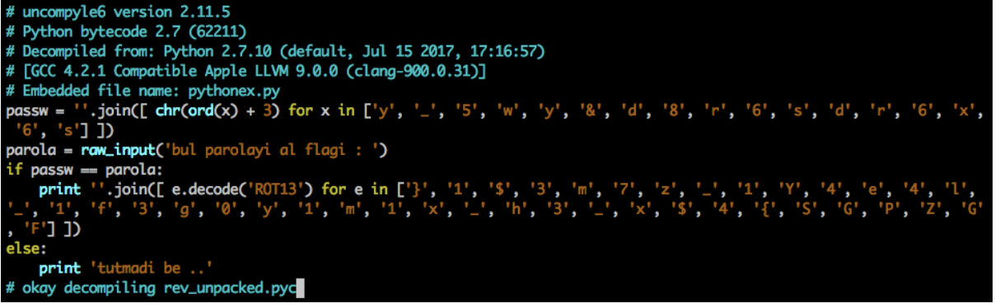

14. passw değişkeni print komutuyla ekrana çıkartılarak ve input olarak girilerek flag’e ulaşılacaktır. 

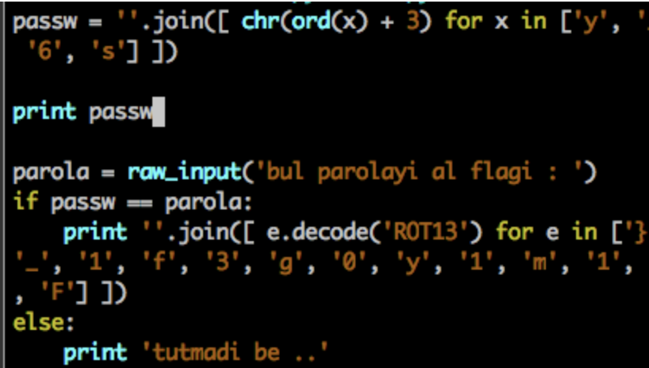

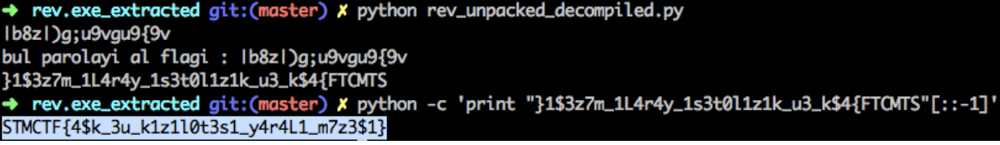

**Flag: STMCTF{4$k_3u_k1z1l0t3s1_y4r4L1_m7z3$1}**
