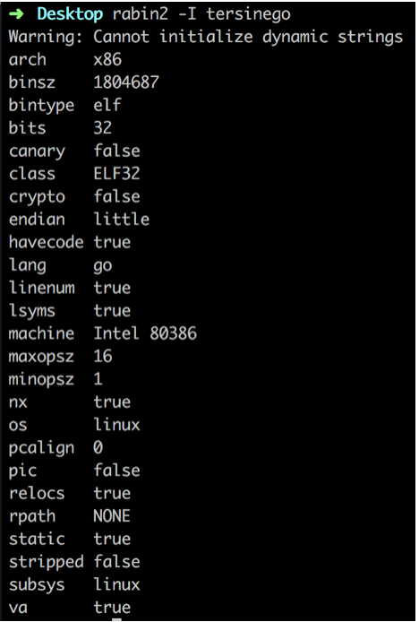
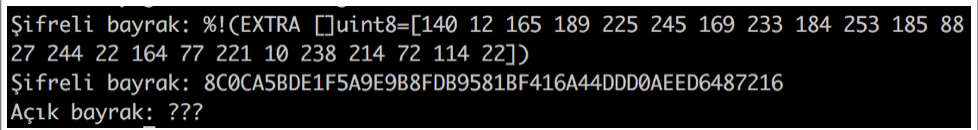
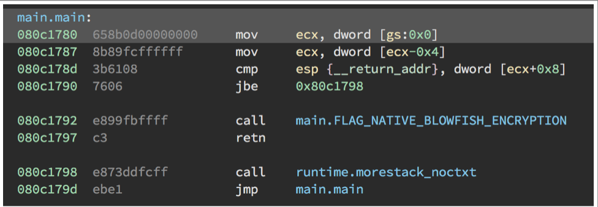
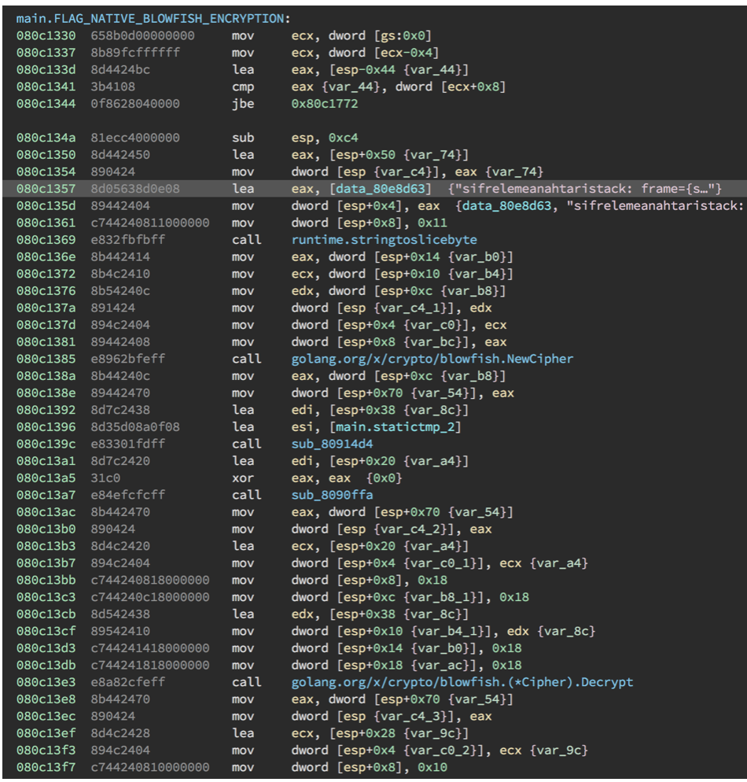
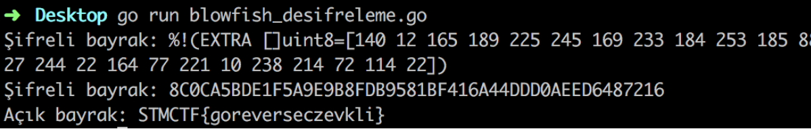

## Soru İsmi: Tersinego
Hazırlayan: [mertcan](https://twitter.com/mertcancoskuner)
## Soru Metni: 

Tersine mühendislik yeteneklerini görelim bakalım!

Soruda verilen dosya: [tersinego.zip](tersinego.zip)

## Çözüm: 

1. Uygulama incelendiğinde Go ile yazıldığı fakat 32-bit elf olarak derlendiği görülmektedir. 
Bizden ilgili binary’nin tersine mühendislik yöntemleri ile açılması ve incelenmesi istenmektedir.



2. Uygulama çalıştırıldığında aşağıdaki gibi çıktı vermektedir. Bayrak şifreli şekilde sunulmakta ve açık hali beklenmektedir.



3. Uygulama açılıp incelendiğinde main kısmında FLAG_NATIVE_BLOWFISH_ENCRYPTION fonksiyonunun çağırıldığı görülmektedir.



4. FLAG_NATIVE_BLOWFISH_ENCRYPTION fonksiyonuna gidildiğinde ‘sifrelemeanahtari’ ile şifreleme anahtarı görülmektedir.
Go ile yazılan uygulada ‘golang.org/x/crypto/blowfish' kütüphanesi kullanıldığı ve NewCipher, 
Decrypt özelliklerinin çalıştırıldığı görülmektedir.



5. Bu bilgiler doğrultusunda şifreli bayrak ve şifreleme anahtarı kullanılarak Go ile blowfish deşifreleme fonksiyonu yazmak için 
Go’nun kendi native kütüphanesi olan `golang.org/x/crypto/blowfish` kütüphanesi `go get golang.org/x/crypto/blowfish` ile indirildikten 
sonra deşifreleme fonksiyonu aşağıdaki gibi yazılabilmektedir.

```go
package main

import (
	"bytes"
	“fmt"

	"golang.org/x/crypto/blowfish"
)

func FLAG_NATIVE_BLOWFISH_ENCRYPTION() {
	key := []byte("sifrelemeanahtari")
	cipher, _ := blowfish.NewCipher(key)
	enc := []uint8{140, 12, 165, 189, 225, 245, 169, 233, 184, 253, 185, 88, 27, 244, 22, 164, 77, 221, 10, 238, 214, 72, 114, 22}
	var decrypt [24]byte
	cipher.Decrypt(decrypt[0:], enc[0:])
	cipher.Decrypt(decrypt[8:], enc[8:])
	cipher.Decrypt(decrypt[16:], enc[16:])
	ciphertext := bytes.NewBuffer(nil)
	ciphertext.Write(enc[0:])
	fmt.Printf("Şifreli bayrak: ", (ciphertext.Bytes()))
	fmt.Printf("\nŞifreli bayrak: %X", (ciphertext.Bytes()))
	result := bytes.NewBuffer(nil)
	result.Write(decrypt[0:24])
	fmt.Println("\nAçık bayrak:", string(result.Bytes()))
}
func main() {
	FLAG_NATIVE_BLOWFISH_ENCRYPTION()
}
```

İlgili kod çalıştırıldığında açık bayrak elde edilebilecektir. 



**Flag = STMCTF{goreverseczevkli}**

